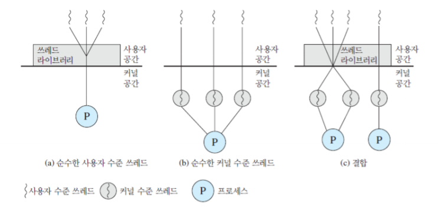

### 04장. 쓰레드

---

- ##### 목표

  - 프로세스와 쓰레드의 차이를 이해할 수 있음
  - 쓰레드와 관련된 기본 설계 이슈를 설명할 수 있음
  - 사용자 수준의 쓰레드와 커널 수준의 쓰레드의 차이를 설명할 수 있음
  
- ##### 프로세스와 쓰레드

  - 현대 OS에서 프로세스는 태스크(Task) 및 쓰레드(Thread)라는 두 객체(특성)으로 분리

    - 태스크 : 사용자 문맥, 시스템 문맥(Resource Container) -> 프로세스와 혼용하여 사용하기도 함
    - 쓰레드 : 제어 흐름(실행 정보, 레지스터 문맥) -> 경량 프로세스라고 부르기도 함

  - 쓰레드 모델

    

- ##### 쓰레드(Thread)

  - 장점

    - 프로세스에 비해 새로운 쓰레드 생성 시간/비용이 절약
    - 프로세스 종료 시간보다 쓰레드 종료 시간이 짦음
    - 한 프로세스 내의 두 쓰레드들 사이의 교환/교체 시간이 짧음
    - 동일 프로세스 내의 쓰레드들은 메모리 및 파일을 공유하기 때문에, 이들 쓰레드들은 커널의 개입 없이 서로 통신 가능

  - 기능

    - 상태 : 수행, 준비, 블록
    - 기본적인 쓰레드 연산 : 생성, 디스패치, 블록, 비블록, 종료

    - 단일 처리기 상에서 다중 쓰레딩의 예

      

    - 동기화(Synchronization)

      - 한 프로세스 내의 모든 쓰레드들은 동일 주소 공간 및 자원들을 공유
      - 공유 자원 : 변수, 파일, 이중 연결 리스트
      - 공유 자원에 대해 동시 접근 시(특히, 갱신 시), 일관성 유지 기법 필요 

  - 유형

    

    - 사용자 수준 쓰레드(User-level Thread, ULT)
      - 응용 프로그램이 모든 쓰레드 관리를 책임짐
      - 커널은 쓰레드의 존재를 모름
    - 커널 수준 쓰레드(Kernel-level Thread, KLT)
      - 커널이 프로세스 및 쓰레드에 대한 문맥 정보를 관리

  - 사용자 수준 쓰레드의 장단점

    - 장점 
      - 쓰레드 교환/교체 시에 커널 모드 권한이 불필요 (두 번의 모드 전이 오버헤드를 절약 가능) 
      - 특정 응용에 적합한 스케줄링 적용 가능
      - 모든 OS에서 수행 가능 
    - 단점
      - 한 쓰레드가 블록 상태를 유발하는 시스템 호출을 수행할 경우, 자신뿐만 아니라 그 프로세스 내의 모든 다른 쓰레드들도 블록됨
      - 다중처리기의 장점을 살리지 못함
      - 커널 루틴 자체는 다중쓰레딩 될 수 없음

---

