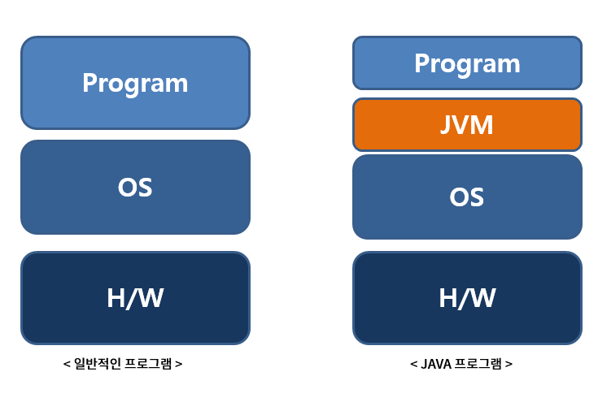

### [JAVA] 동작 원리

---

Assembly by Ricky (2019-10-27)

- #####  Introduction

  

  - 자바는 OS에 독립적인 특징을 가지고 있는데, 그것이 가능한 이유는 JVM(Java Vitual Machine) 상에서 실행되기 때문입니다. 
  - JVM에 대해 간략하게 설명하자면, 자바 소스코드 컴파일 후 생성된 파일이 해석(Interpret)과 Link없이 바로 JVM에 적재되고, OS로 부터 메모리를 할당받아 GC(Garbage Collection)를 통해 스스로 메모리 관리를 한다는 특징이 있습니다.
  - 이제 본격적으로 JAVA의 동작원리에 대해 학습해보겠습니다.

<br>

- ##### Body

  

  - 우선 위의 그림을 토대로 간략하게 동작원리에 대해 짚고 넘어가보겠습니다.

    1. **```작성한 자바 소스(.java)를 자바 컴파일러를 통해 자바 바이트 코드(.class)로 컴파일합니다.```**

       - 자바 바이트 코드 : JVM이 이해할 수 있는 코드로 아직 컴퓨터는 읽을 수 없는 반기계어입니다. 자바 바이트 코드의 각 명령어는 1바이트 크기의 Opcode와 추가 피연산자로 이루어져 있습니다. 

    2. **```컴파일된 바이트코드를 JVM의 클래스 로더에게 전달합니다.```**

       - 클래스 로더 세부 동작

         - 로드 : 클래스 파일을 가져와서 JVM의 메모리에 로드합니다.

         - 검증 : 자바 언어 명세(Java Language Specification) 및 JVM 명세에 명시된 대로 구성되어 있는지 검사합니다.

         - 준비 : 클래스가 필요로 하는 메모리를 할당합니다. (필드, 메서드, 인터페이스 등등)

         - 분석 : 클래스의 상수 풀 내 모든 심볼릭 레퍼런스를 다이렉트 레퍼런스로 변경합니다.

         - 초기화 : 클래스 변수들을 적절한 값으로 초기화합니다. (static 필드)

    3. **```JVM의 클래스 로더는 동적 로딩(Dynamic Loading)을 통해 필요한 클래스들을 로딩 및 링크하여 런타임 데이터 영역(Runtime Data area), 즉 JVM의 메모리에 올립니다.```**

    4. **```실행엔진(Execution Engine)은 JVM 메모리에 올라온 바이트 코드들을 명령어 단위로 하나씩 가져와서 실행합니다. 이때, 실행엔진은 2가지 방식으로 동작할 수 있습니다.```**

       - 자바 인터프리터 : 바이트 코드 명령어를 하나씩 읽어서 해석하고 실행합니다. 하나하나의 실행은 빠르나, 전체적인 실행 속도가 느리다는 단점을 가집니다.
       - JIT 컴파일러(Just-In-Time Compiler) : 인터프리터의 단점을 보완하기 위해 도입된 방식으로 바이트 코드 전체를 컴파일하여 바이너리 코드로 변경하고 이후에는 해당 메서드를 더이상 인터프리팅 하지 않고, 바이너리 코드로 직접 실행하는 방식입니다. 하나씩 인터프리팅하여 실행하는 것이 아니라 바이트 코드 전체가 컴파일된 바이너리 코드를 실행하는 것이기 때문에 전체적인 실행속도는 인터프리팅 방식보다 빠릅니다. 

<br>

- ##### Conclusion

  - 자바 개발자에게 필수적으로 알아야하는 자바 동작원리에 대해 간략하게 알아보았습니다. 다음으로는 JVM이 GC(Garbage Collection)를 통해 메모리 관리를 어떻게 하는지 알아보도록 하겠습니다.

<br>

- ##### Reference & Additional Resources

  -  https://d2.naver.com/helloworld/1230 
  -  https://preamtree.tistory.com/2 
  -  https://steady-snail.tistory.com/67 

---

