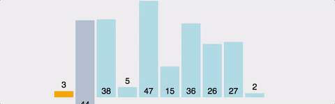

# 삽입 정렬 (Insertion Sort)

*Assembled by Ricky (2019-10-30)*

<br>

## Goal

- Insertion Sort에 대해 설명할 수 있다.
- Insertion Sort 과정에 대해 설명할 수 있다.
- Insertion Sort을 구현할 수 있다.
- Insertion Sort의 시간복잡도와 공간복잡도를 계산할 수 있다.
- Insertion Sort와 Selection Sort 차이에 대해 설명할 수 있다.

<br>

## Abstract

손 안의 카드를 정렬하는 방법과 유사합니다.

Insertion Sort는 Selection Sort와 유사하지만, 좀 더 효율적인 정렬 알고리즘입니다.

Insertion Sort는 **2번째 원소부터 시작하여 그 앞(왼쪽)의 원소들과 비교하여 삽입할 위치를 지정한 후, 원소를 뒤로 옮기고 지정된 자리에 자료를 삽입**하여 정렬하는 알고리즘입니다.

최선의 경우 O(N)이라는 엄청나게 빠른 효율성을 가지고 있어, 다른 정렬 알고리즘의 일부로 사용될 만큼 좋은 정렬 알고리즘입니다.

<br>

## Process (Ascending)

1. 정렬은 2번째 위치(index)의 값을 temp에 저장합니다.
2. temp와 이전에 있는 원소들과 비교하며 삽입해나갑니다.
3. '1'번으로 돌아가 다음 위치(index)의 값을 temp에 저장하고, 반복합니다.

<br>

## Java Code (Ascending)

```java
void insertionSort(int[] arr)
{
   for(int index = 1 ; index < arr.length ; index++){ // 1.
      int temp = arr[index];
      int prev = index - 1;
      while( (prev >= 0) && (arr[prev] > temp) ) {    // 2.
         arr[prev+1] = arr[prev];
         prev--;
      }
      arr[prev + 1] = temp;                           // 3.
   }
   System.out.println(Arrays.toString(arr));
}
```

1. 첫 번째 원소 앞(왼쪽)에는 어떤 원소도 갖고 있지 않기 때문에, 두 번째 위치(index)부터 탐색을 시작합니다. temp에 임시로 해당 위치(index) 값을 저장하고, prev에는 해당 위치(index)의 이전 위치(index)를 저장합니다.
2. 이전 위치(index)를 가르키는 prev가 음수가 되지 않고, 이전 위치(index)의 값이 '1'번에서 선택한 값보다 크다면, 서로 값을 교환해주고 prev를 더 이전 위치(index)를 가르키도록 합니다.
3. '2'번에서 반복문이 끝나고 난 뒤, prev에는 현재 **temp 값보다 작은 값들 중 제일 큰 값의 위치(index)**를 가르키게 됩니다. 따라서, (prev+1)에 temp 값을 삽입해줍니다.

<br>

## GIF로 이해하는 Insertion Sort



<br>

## 시간복잡도 & 공간복잡도

- 시간복잡도
    - 최악의 경우(역으로 정렬되어 있을 경우) Selection Sort와 마찬가지로, ```(n-1) + (n-2) + .... + 2 + 1 => n(n-1)/2``` 즉, **O(n^2)**입니다. 
    - 하지만, 모두 정렬이 되어있는 경우(Optimal)한 경우, 한번씩 밖에 비교를 안하므로 **O(n)**의 시간복잡도를 가지게 됩니다. 
    - 또한, 이미 정렬되어 있는 배열에 자료를 하나씩 삽입/제거하는 경우에는, 현실적으로 최고의 정렬 알고리즘이 되는데, 탐색을 제외한 오버헤드가 매우 적기 때문입니다. 
    - 최선은 O(n)의 시간복잡도를 갖고, 평균과 최악의 경우 O(n^2)의 시간복잡도를 갖게됩니다.

- 공간복잡도

  - 주어진 배열 안에서 교환(swap)을 통해, 정렬이 수행되므로 **O(n)**입니다.

<br>

## 장점

- 알고리즘이 단순합니다.
- 대부분의 원소가 이미 정렬되어 있는 경우, 매우 효율적일 수 있습니다.
- 정렬하고자 하는 배열 안에서 교환하는 방식이므로, 다른 메모리 공간을 필요로 하지 않습니다. => 제자리 정렬(in-place sorting)
- **안정 정렬(Stable Sort)** 입니다.
- Selection Sort나 Bubble Sort과 같은 O(n^2) 알고리즘에 비교하여 상대적으로 빠릅니다.

## 단점

- 평균과 최악의 시간복잡도가 O(n^2)으로 비효율적입니다.
- Bubble Sort와 Selection Sort와 마찬가지로, 배열의 길이가 길어질수록 비효율적입니다.

<br>

## Conclusion

Selection Sort와 Insertion Sort는 k번째 반복 이후, 첫번째 k 요소가 정렬된 순서로 온다는 점에서 유사합니다. 하지만, Selection Sort는 k+1번째 요소를 찾기 위해 나머지 모든 요소들을 탐색하지만 Insertion Sort는 k+1번째 요소를 배치하는 데 필요한 만큼의 요소만 탐색하기 때문에 훨씬 효율적으로 실행된다는 차이가 있습니다. 

<br>

## Reference & Additional Resources

- https://gmlwjd9405.github.io/2018/05/06/algorithm-insertion-sort.html 
- [https://ko.wikipedia.org/wiki/%EC%82%BD%EC%9E%85_%EC%A0%95%EB%A0%AC](https://ko.wikipedia.org/wiki/삽입_정렬) 
- https://jinhyy.tistory.com/9
- https://zeddios.tistory.com/20#recentComments 

---

