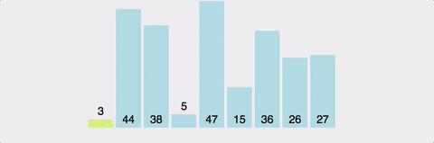
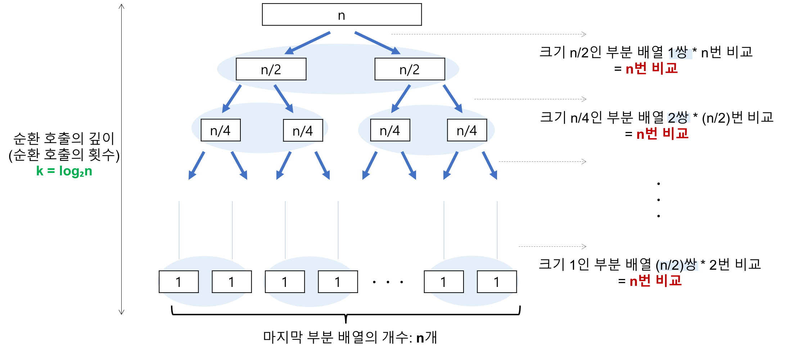
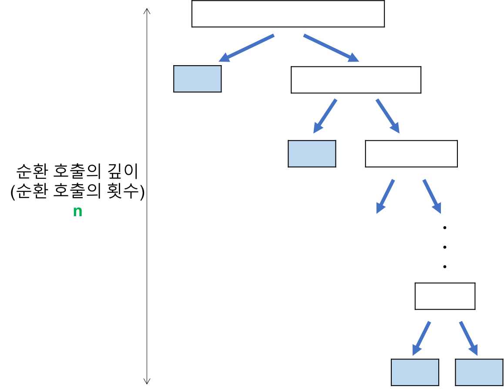

## 퀵 정렬 (Quick Sort)

*Assembled by GimunLee (2019-11-14)*

<br>

## Goal

- Quick Sort에 대해 설명할 수 있다.
- Quick Sort 과정에 대해 설명할 수 있다.
- Quick Sort을 구현할 수 있다.
- Quick Sort의 시간복잡도와 공간복잡도를 계산할 수 있다.
- Quick Sort의 최악인 경우를 개선시킬 수 있다.

<br>

## Abstract

Quick Sort은 **분할 정복(divide and conquer) 방법** 을 통해 주어진 배열을 정렬합니다.

`* 분할 정복(divide and conquer) 방법 : 문제를 작은 2개의 문제로 분리하고 각각을 해결한 다음, 결과를 모아서 원래의 문제를 해결하는 전략입니다.`

Quick Sort은 불안정 정렬에 속하며, 다른 원소와의 비교만으로 정렬을 수행하는 비교 정렬에 속합니다. 또한 Merge Sort와 달리 Quick Sort는 배열을 비균등하게 분할합니다.

<br>

## Process (Ascending)

1. 배열 가운데서 하나의 원소를 고릅니다. 이렇게 고른 원소를 **피벗(pivot)** 이라고 합니다.
2. 피벗 앞에는 피벗보다 값이 작은 모든 원소들이 오고, 피벗 뒤에는 피벗보다 값이 큰 모든 원소들이 오도록 피벗을 기준으로 배열을 둘로 나눕니다. 이렇게 배열을 둘로 나누는 것을 **분할(Divide)** 이라고 합니다. 분할을 마친 뒤에 피벗은 더 이상 움직이지 않습니다.
3. 분할된 두 개의 작은 배열에 대해 재귀(Recursion)적으로 이 과정을 반복합니다. 

- 재귀 호출이 한번 진행될 때마다 최소한 하나의 원소는 최종적으로 위치가 정해지므로, 이 알고리즘은 반드시 끝난다는 것을 보장할 수 있습니다.

<br>

## Java Code (Ascending)

퀵 정렬은 다음의 단계들로 이루어집니다.

- 정복 (Conquer)

  부분 배열을 정렬합니다. 부분 배열의 크기가 충분히 작지 않으면 순환 호출을 이용하여 다시 분할 정복 방법을 적용합니다.

  ```java
  public void quickSort(int[] array, int left, int right) {
      if(left >= right) return;
      
      // 분할 
      int pivot = partition(); 
      
      // 피벗은 제외한 2개의 부분 배열을 대상으로 순환 호출
      quickSort(array, left, pivot-1);  // 정복(Conquer)
      quickSort(array, pivot+1, right); // 정복(Conquer)
  }
  ```

- 분할 (Divide)

  입력 배열을 피벗을 기준으로 비균등하게 2개의 부분 배열(피벗을 중심으로 왼쪽 : 피벗보다 작은 요소들, 오른쪽 : 피벗보다 큰 요소들)로 분할합니다.
  
  ```java
  public int partition(int[] array, int left, int right) {
      /**
      // 최악의 경우, 개선 방법
      int mid = (left + right) / 2;
      swap(array, left, mid);
      */
      
      int pivot = array[left]; // 가장 왼쪽값을 피벗으로 설정
      int i = left, j = right;
      
      while(i < j) {
          while(pivot < array[j]) {
              j--;
          }
          while(i < j && pivot >= array[i]){
              i++;
          }
          swap(array, i, j);
      }
      array[left] = array[i];
      array[i] = pivot;
      
      return i;
  }
  ```

<br>

## Quick Sort 개선

partition() 함수에서 **피벗 값이 최소나 최대값으로 지정되어 파티션이 나누어지지 않았을 때,** O(n^2)에 대한 시간복잡도를 가집니다. 즉, 정렬하고자 하는 배열이 오름차순 정렬되어있거나 내림차순 정렬되어있으면 O(n^2)의 시간복잡도를 갖습니다. 

이때, 배열에서 가장 앞에 있는 값과 중간값을 교환해준다면 확률적으로나마 시간복잡도 O(nlog₂n)으로 개선할 수 있습니다.

하지만, 이 방법으로 개선한다해도 Quick Sort의 최악의 시간복잡도가 O(nlog₂n)가 되는 것은 아닙니다.

<br>

## GIF로 이해하는 Quick Sort



<br>

## 시간복잡도 & 공간복잡도

- 시간복잡도

  - **최선 / T(n) = O(nlog₂n)**

    - 비교 횟수

      
      - 순환 호출의 깊이 (k=log₂n)
        - 레코드의 개수 n이 2의 거듭제곱이라고 가정(n=2^k)했을 때, n=2^3의 경우, 2^3 -> 2^2 -> 2^1 -> 2^0 순으로 줄어들어 순환 호출의 깊이가 3임을 알 수 있습니다. 이것을 일반화하면 n=2^k의 경우, **k(k=log₂n)** 임을 알 수 있습니다.
      - 각 순환 호출 단계의 비교 연산 (n)
        - 각 순환 호출에서는 전체 리스트의 대부분의 레코드를 비교해야 하므로 **평균 n번** 정도의 비교가 이루어집니다.
      - ```순환 호출의 깊이 * 각 순환 호출 단계의 비교 연산 = nlog₂n```

    - 이동 횟수는 비교 횟수보다 적으므로 무시할 수 있다.

  - **최악 / T(n) = O(n^2)**

    - 최악의 경우는 정렬하고자 하는 배열이 오름차순 정렬되어있거나 내림차순 정렬되어있는 경우입니다. 

    - 비교 횟수

      

      - 순환 호출의 깊이 (n)
        - 레코드의 개수 n이 2의 거듭제곱이라고 가정(n=2^k)했을 때, 순환 호출의 깊이는 **n** 임을 알 수 있습니다.
      - 각 순환 호출 단계의 비교 연산 (n)
        - 각 순환 호출에서는 전체 리스트의 대부분의 레코드를 비교해야 하므로 **평균 n번 ** 정도의 비교가 이루어집니다.
      - ```순환 호출의 깊이 * 각 순환 호출 단계의 비교 연산 = n^2```

    - 이동 횟수는 비교 횟수보다 적으므로 무시할 수 있습니다.

  - **평균 /  T(n) = O(nlog₂n)**

- 공간복잡도
  
  - 주어진 배열 안에서 교환(swap)을 통해, 정렬이 수행되므로 **O(n)**입니다.

<br>

## 장점

- 불필요한 데이터의 이동을 줄이고 먼 거리의 데이터를 교환할 뿐만 아니라, 한 번 결정된 피벗들이 추후 연산에서 제외되는 특성 때문에, 시간 복잡도가 O(nlog₂n)를 가지는 다른 정렬 알고리즘과 비교했을 때도 가장 빠릅니다.
- 정렬하고자 하는 배열 안에서 교환하는 방식이므로, 다른 메모리 공간을 필요로 하지 않습니다. 

<br>

## 단점

- **불안정 정렬(Unstable Sort)** 입니다.
- 정렬된 배열에 대해서는 Quick Sort의 불균형 분할에 의해 오히려 수행시간이 더 많이 걸립니다.

<br>

## Conclusion

평균적으로 가장 빠른 정렬 알고리즘에 대해서 알아보았습니다. JAVA에서 Arrays.sort() 내부적으로도 Dual Pivot Quick Sort로 구현되어 있을 정도로 효율적인 알고리즘이고, ```기술 면접에서 정말 빈번하게 나오는 주제이므로 반드시 숙지하시길 바랍니다.```

<br>

## Reference & Additional Resources

- https://jinhyy.tistory.com/9 
- https://gmlwjd9405.github.io/2018/05/10/algorithm-quick-sort.html 

