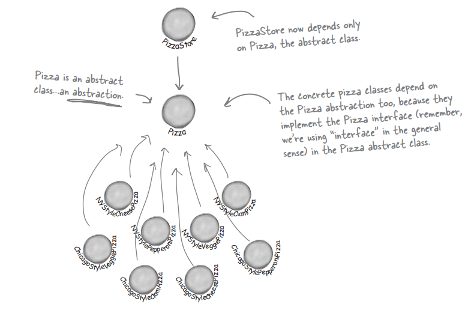

# 🍐🏭 Factory Pattern (2) - Abstract Factory Pattern

*Assembled by GimunLee (2020-01-11)*

<br/>

## Goal

- Factory Pattern의 개념을 알 수 있다.
- Simple Factory와 Factory Method Pattern의 차이점에 대해 설명할 수 있다.
- Factory Method Pattern의 사용 이점에 대해 설명할 수 있다.

<br/>

## 피자 가게 차리기

여러분이 피자 가게를 운영하고 있고, 객체마을의 최첨단 피자 가게 주인답게 다음과 같은 코드를 만들었다고 가정해 봅시다.

```java
Pizza orderPizza(String type) { // 피자 종류 전달
    Pizza pizza;

    if(type.equals("cheese")){
        pizza = new CheesePizza();
    }else if(type.equals("greek")){
        pizza = new GreekPizza();
    }else if(type.equals("pepperoni")){
        pizza = new PepperoniPizza();
    }

    pizza.prepare();
    pizza.bake();
    pizza.cut();
    pizza.box();

    return pizza;
}
```

피자 가게에서 조개 피자(Clam Pizza)하고 야채 피자(Veggie Pizza)를 메뉴에 추가하기로 했습니다. 그리고 그리스식(Greek Pizza)가 별로 안 팔려서 메뉴에서 제외시키기로 했습니다.

```java
Pizza orderPizza(String type) { // 피자 종류 전달
    Pizza pizza;

    if(type.equals("cheese")){
        pizza = new CheesePizza();
    }
    // else if(type.equals("greek")){
    //    pizza = new GreekPizza();
    // }
    else if(type.equals("pepperoni")){
        pizza = new PepperoniPizza();
    }else if(type.equals("clam")){
        pizza = new ClamPizza();
    }else if(type.equals("veggie")){
        pizza = new veggiePizza();
    }
    // 메뉴가 변경될 때 마다 위 코드는 계속 변경돼야함

    // 이 밑 부분은 변경되지 않음
    pizza.prepare();
    pizza.bake();
    pizza.cut();
    pizza.box();

    return pizza;
}
```

orderPizza() 메소드에서 가장 문제가 되는 부분은 바로 인스턴스를 만들 구상 클래스를 선택하는 부분입니다. 그 부분 때문에 상황에 따라 코드를 변경할 수 밖에 없습니다. 이제 어떤 부분이 바뀌고 어떤 부분이 바뀌지 않는지를 파악했으니 캡슐화를 해보겠습니다.

<br/>

## 객체 생성 캡슐화

객체 생성 코드만 따로 빼서 피자 객체를 만드는 일만 전담하는 다른 객체에 집어넣어 보도록 하겠습니다. 

**새로 만들 객체에는 팩토리(Factory라는 이름을 붙이기로 합시다.**

객체 생성을 처리하는 클래스를 팩토리라고 부릅니다. 일단 SimplePizzaFactory를 만들고 나면 orderPizza() 메소드는 새로 만든 객체의 클라이언트가 됩니다. 즉 새로 만든 객체를 호출하는 거죠. 피자가 필요할 때 마다 피자 공장에 피자 하나 만들어 달라고 부탁한다고 생각하면 됩니다. 이제 더 이상 orderPizza() 메소드에서 어떤 피자를 만들어야 하는지 고민하지 않아도 됩니다. orderPizza() 메소드에서는 Pizza 인터페이스를 구현하는 피자를 받아서 그 인터페이스에서 정의했던 prepare(), bake(), cut(), box() 메소드를 호출하기만 하면 됩니다.

<br/>

## 간단한 피자 팩토리 만들기

새로 만들 SimplePizzaFactory 클래스에서 하는 일은 하나 뿐입니다. 클라이언트를 위해서 피자를 만들어주기만 하면 됩니다.

```java
public class SimplePizzaFactory {
    public Pizza createPizza(String type) {
        Pizza pizza = null;

        if(type.equals("cheese")) {
            pizza = new CheesePizza();
        }else if(type.equals("pepperoni")){
            pizza = new PepperoniPizza();
        }else if(type.equals("clam")){
            pizza = new ClamPizza();
        }else if(type.equals("veggie")){
            pizza = new VeggiePizza();
        }
        return pizza();
    }
}
```

### 바보같은 질문은 없습니다.

#### 이렇게 하면 무슨 장점이 있는 건가요? 아까 그 문제를 그냥 다른 객체로 넘겨 버렸을 뿐인 것 같은데요?

> SimplePizzaFactory를 사용하는 클라이언트가 매우 많을 수 있다는 점을 생각해 보세요. 여기에는 orderPizza() 메소드만 나와 있지만, 피자 객체를 받아서 가격이라든가 피자에 대한 설명 등을 찾아서 활용하는 PizzaShopMenu 같은 클래스라든가, 아까 봤던 PizzaStore 클래스에서 했던 것과는 조금 다른 방식으로 피자 주문을 처리하는 HomeDelivery 같은 클래스에서도 이 팩토리를 사용할 수 있을 것입니다. 

#### 비슷한 식을 팩토리를 쓰는데, 메소드를 정적 메소드로 선언한 디자인을 본 적이 있어요. 그 디자인이랑 이 디자인은 어떻게 다른거죠?

> 간단한 팩토리를 정적 메소드로 정의하는 기법도 일반적으로 많이 쓰입니다. 정적 팩토리(static factory)라고 부르기도 하죠. 왜 정적 메소드를 쓰는지 궁금하죠? 정적 메소드를 쓰면 객체를 생성하기 위한 메소드를 실행시키기 위해서 객체의 인스턴스를 만들지 않아도 되기 때문입니다. 하지만 서브클래스를 만들어서 객체 생성 메소드의 행동을 변경시킬 수 없다는 단점이 있다는 것도 꼭 기억해두세요.

이제 클라이언트 코드를 고쳐보겠습니다.

```java
public class PizzaStore {
    SimplePizzaFactory factory;

    public PizzaStore (SimplePizzaFactory factory) {
        this.factory = factory;
    }

    public Pizza orderPizza(String type){
        Pizza pizza;

        pizza = factory.createPizza(type);

        pizza.prepare();
        pizza.bake();
        pizza.cut();
        pizza.box();

        return pizza;
    }
}
```

간단한 팩토리(Simple Factory)는 디자인 패턴이라고 할 수는 없습니다. 프로그래밍을 하는데 있어서 자주 쓰이는 관용구에 가깝다고 할 수 있습니다. 

위에서 만든 피자 가게 프로그램의 클래스 다이어그램을 한번 살펴보겠습니다. 


간단한 팩토리는 워밍업이라고 생각합시다. 이제부터 팩토리에 해당하는 두 가지 강력한 패턴을 알아보겠습니다.

<br/>

## 피자 프렌차이즈 사업

프렌차이즈를 운영하게 됐습니다. 지금까지 잘 써왔던 코드를 다른 지점에서도 쓸 수 있도록 만들기로 했습니다. 

하지만 지역별로 조금씩 다른 차이점을 어떤 식으로 적용해야 할까요? 각 지점마다 그 지역의 특성과 입맛을 반영하여 다른 스타일의 피자(뉴옥 스타일, 시카고 스타일, 캘리포니아 스타일)를 만들어야 합니다. 

SimplePizzaFactory를 빼고 세 가지 서로 다른 팩토리(NYPizzaFactory, ChicagoPizzaFactory, CaliforniaPizzaFactory)를 만든 다음, PizzaStore에서 적당한 팩토리를 사용하도록 하면 분점에서도 전혀 문제 없이 쓸 수 있을 것입니다. 

그 방법을 적용하면 어떻게 될지 한번 살펴보겠습니다.

**뉴옥 분점**

```java
NYPizzaFactory nyFactory = new NYPizzaFactory();
PizzaStore nyStore = new PizzaStore(nyFactory);
nyStore.order("Veggie");
```

**시카고 분점**

```java
ChicagoPizzaFactory chicagoFactory = new ChicagoPizzaFactory();
PizzaStore chicagoStore = new PizzaStore(chicagoFactory);
chicagoStore.order("Veggie");
```

방금 얘기한 방법을 직접 적용해 봤습니다. 하지만, 본점에서 우리가 만든 팩토리를 써서 피자를 만들긴 하는데, 독자적인 방법들을 사용하기 시작했습니다. 굽는 방식이 달라진다거나 종종 피자를 자르는 것을 까먹어 버리는 일이 일어나기 시작했습니다. 

이 문제를 다시 한번 생각해보니, 피자 가게와 피자 제작 과정 전체를 하나로 묶어주는 프레임워크를 만들어야 되겠다는 결론에 도달했습니다. 물론 그렇게 하면서도 유연성을 잃어버리면 안 되겠죠.

SimplePizzaFactory를 만들기 전에 썼던 코드에서는 피자를 만드는 코드가 PizzaStore하고 직접 연결되어 있긴 했었지만, 유연성이 전혀 없었습니다. 

**그러면 어떻게 해야 피자 가게하고 피자 만드는 과정을 하나로 묶을 수 있을까요?**

<br/>

## 피자 가게 프레임워크

피자를 만드는 할동 자체는 전부 PizzaStore 클래스에 국한시키면서도 분점마다 고유의 스타일을 살릴 수 있도록 하는 방법이 있습니다. 

이제 createPizza() 메소드를 PizzaStore에 다시 집어넣겠습니다. 하지만 이번에는 그 메소드를 **추상 메소드** 로 선언하고, 각 지역마다 고유의 스타일에 맞게 PizzaStore의 서브클래스를 만들도록 할 것입니다.

우선 PizzaStore가 어떻게 달라지는지 살펴보겠습니다. 

```java
public abstract class PizzaStore {
    public Pizza orderPizza(String type){
        Pizza pizza;

        pizza = createPizza(type); // 팩토리 객체가 아닌 PizzaStore에 있는 메소드 호출

        pizza.prepare();
        pizza.bake();
        pizza.cut();
        pizza.box();

        return pizza;
    }

    abstract Pizza createPizza(String type); // 팩토리 객체 대신 이 메소드 사용
}
```

각 분점을 위한 서브클래스가 필요합니다. 이제 각 지역별로 서브클래스를 만들어야 합니다. 피자의 스타일은 각 서브클래스에서 결정합니다. 어떤 식으로 돌아가는지 살펴봅시다.

### 서브클래스에서 결정되는 것

PizzaStore의 orderPizza() 메소드에 이미 주문 시스템이 잘 갖춰져 있습니다. 이 주문 시스템 자체는 모든 분점에서 똑같이 진행되어야 합니다.

각 분점마다 달라질 수 있는 것은 피자의 스타일 뿐입니다. 뉴옥풍 피자는 빵이 얇고, 시카고 풍 피자는 빵이 두꺼운 식으로 말이죠. 이렇게 달라지는 점들은 createPizza() 메소드에 집어넣고 그 메소드에서 해당 스타일의 피자를 만드는 것을 모두 책임지도록 할 계획입니다. PizzaStore의 서브클래스에서 createPizza() 메소드를 구현하도록 하면 되죠. 이제 PizzaStore 프레임워크에 충실하면서도 각각의 스타일을 제대로 구현할 수 있는 orderPizza() 메소드를 가지고 있는 PizzaStore 서브클래스들을 구비할 수 있습니다.

**뉴옥 분점**

```java
public class NYPizzaStore extends PizzaStore {

    // 추상메소드로 선언되었기 때문에 반드시 구현
    public Pizza createPizza(String item) {
        if(item.equals("cheese")){
            return new NYStyleCheesePize();
        }else if(item.equals("pepperoni")){
            return new NYStylePepperoniPizza();
        }else if(item.equals("clam")){
            return new NYStyleClamPizza();
        }else if(item.equals("veggie")){
            return new NYStyleVeggiePizza();
        }else{
            return null;
        }
    }
}
```

수퍼클래스에 있는 orderPizza() 메소드에서는 어떤 피자가 만들어지는지 전혀 알 수 없다는 점을 잘 이해해야합니다. 그 메소드에서는 피자를 준비하고 굽고 자르고 포장하는 작업을 처리할 뿐입니다.

<br/>

## 팩토리 메소드 선언

PizzaStore를 몇 군데 고친 결과, 

**구상 클래스의 인스턴스를 만드는 일을 한 객체에서 전부 처리하는 방식** 에서

**일련의 서브클래스에서 처리하는 방식** 으로 넘어오게 되었습니다. 한번 자세히 살펴보겠습니다. 

```java
public abstract class PizzaStore {

    public Pizza orederPizza(String type){
        Pizza pizza;

        pizza = createPizza(type);

        pizza.prepare();
        pizza.bake();
        pizza.cut();
        pizza.box();

        return pizza;
    }

    // Pizza 인스턴스를 만드는 일을 이제 팩토리 역할을 하는 메소드에서 맡아서 처리
    protected abstract Pizza createPizza(String type); 
}
```

팩토리 메소드는 객체 생성을 처리하며, 팩토리 메소드를 이용하면 객체를 생성하는 작업을 서브클래스에서 캡슐화시킬 수 있습니다. 이렇게 하면 수퍼클래스에 있는 클라이언트 코드와 서브클래스에 있는 객체 생성 코드를 분리시킬 수 있습니다. 

```java
abstract Product factoryMethod(String type)
```

<br/>

## 피자 주문

> @에단 : 나는 뉴옥풍 피자가 좋아. 얇고 바삭바삭한 빵에 치즈는 약간만 올리고, 맛있는 소스를 써야 진짜 피자 맛이 나지.

피자 팩토리 메소드를 이용한 피자 주문 과정을 한번 살펴보겠습니다.

1. 에단이 주문한 내역을 따라가 봅시다. 우선 NYPizzaStore가 필요합니다.
   
    ```java
    PizzaStore nyPizzaStore = new NYPizzaStore();
    ```

2. 피자 가게가 확보됐으니까 주문을 받을 수 있습니다.

    ```java
    nyPizzaStore.orderPizza("cheese");
    ```

3. orderPizza() 메소드에서 createPizza() 메소드를 호출합니다.

    ```java
    Pizza pizza = createPizza("cheese");
    ```

4. 아직 준비가 되지 않은 피자를 받았습니다. 이제 피자 만드는 작업을 마무리해야 되겠죠.

    ```java
    pizza.prepare();
    pizza.bake();
    pizza.cut();
    pizza.box();
    ```

main에서는 어떻게 작성해야하는지 살펴보겠습니다. 

```java
public class PizzaTestDrive{

    public static void main(String[] args){
        PizzaStore nyStore = new NYPizzaStore();
        
        Pizza pizza = nyStore.orederPizza("cheese");
    }
}
```

<br/>

## 팩토리 메소드 패턴

모든 팩토리 패턴에서는 객체 생성을 캡슐화합니다. 팩토리 메소드 패턴(Factory Method Pattern)에서는 서브클래스에서 어떤 클래스를 만들지를 결정하게 함으로써 객체 생성을 캡슐화합니다. 클래스 다이어그램을 살펴보면서 이 패턴에 등장하는 클래스들을 살펴보겠습니다. 


### 팩토리 메소드 패턴 정의

팩토리 메소드 패턴에서는 객체를 생성하기 위한 인터페이스를 정의하는데, 어떤 클래스의 인스턴스를 만들지는 서브스클래스에서 결정하게 만듭니다. 팩토리 메소드 패턴을 이용하면 클래스의 인스턴스를 만드는 일을 서브클래스에게 맡기는 것입니다.


클래스 다이어그램을 보면, Creator 추상 클래스에서 객체를 만들기 위한 메소드, 즉 팩토리 메소드를 위한 인터페이스를 제공한다는 것을 알 수 있습니다. Creator 추상 클래스에 구현되어 있는 다른 메소드에서는 팩토리 메소드에 의해 생산된 제품을 가지고 필요한 작업을 처리합니다. 하지만 실제 팩토리 메소드를 구현하고 제품(객체 인스턴스)을 만들어내는 일은 서브클래스에서만 할 수 있습니다. 

위에 있는 정의에도 나와 있지만, **"결정한다"** 라는 표현을 쓰는 이유는 이 패턴을 사용할 때 서브클래스에서 실행중에 어떤 클래스의 인스턴스를 만들지를 결정하기 때문이 아니라, 생산자(Creator) 클래스 자체가 실제 생산될 제품에 대한 사전 지식이 전혀 없이 만들어지기 때문입니다. 사실 더 정확하게 표현하자면, 사용하는 서브클래스에 따라 생산되는 객체 인스턴스가 결정될 것입니다.

### 바보같은 질문은 없습니다.

#### 매개변수 팩토리 메소드를 사용하면 형식 안정성(type-safety)에 지장이 있지 않나요? 그냥 String을 매개변수로 전달할 뿐이잖아요. "clam"을 잘못 쳐서 "calm"이라고 치면 어떻게 되는 거죠?

> 만약 그런 실수를 하게 되면 소위 "런타임 오류" 라는 게 발생하게 됩니다. 매개변수 팩토리 메소드를 사용할 때 형식 안정성을 조금 더 잘 보장해줄 수 있는 기법들이 있긴 합니다. 그런 기법을 사용하면 엉뚱한 형식을 만들어낼 수 있는 오류를 컴파일시에 잡아낼 수 있죠. 예를 들어 매개변수 형식을 나타내기 위한 객체를 만들 수도 있고, 정적 상수를 쓸 수도 있고, 자바 5부터는 enum을 사용할 수도 있습니다. 

#### 간단한 팩토리(Simple Factory)와 팩토리 메소드의 차이점을 아직 잘 모르겠어요. 팩토리 메소드 패턴에서는 피자를 리턴하는 클래스가 서브클래스라는 점을 제외하면 거의 똑같잖아요. 조금 더 자세히 설명해 주실 수 있나요?

> 팩토리 메소드 패턴이 간단한 팩토리와 상당히 비슷하다는 지적은 맞습니다. 하지만 간단한 팩토리는 일회용 처방에 불과한 반면, 팩토리 메소드 패턴을 이용하면 어떤 구현을 할지를 서브클래스에서 결정하는 프레임워크를 만들 수 있다는 결정적인 차이점이 있지요. 예를 들어, 팩토리 메소드 패턴에서 사용한 orderPizza() 메소드에서는 피자를 만들기 위한 일반적인 프레임워크를 제공합니다. 그 프레임워크에서는 팩토리 메소드를 이용하여 피자를 만드는 구상 클래스를 만들었죠. PizzaStore 클래스의 서브클래스를 만들 때, 어떤 구상 제품 클래스에서 orderPizza()에서 리턴할 피자를 만들지를 결정하게 됩니다. 이 프레임워크를 간단한 팩토리하고 한번 비교해 보세요. 간단한 팩토리에서는 객체 생성을 캡슐화하는 방법을 사용하긴 하지만 팩토리 메소드 패턴처럼 강력한 유연성을 제공하진 못합니다. 생성하는 제품을 마음대로 변경할 수 없기 때문이죠.

<br/>

## 의존성 뒤집기 원칙(Dependency Inversion Principle)

구상 클래스에 대한 의존성을 줄이는 것이 좋다는 것은 이제 확실히 이해할 수 있을 것입니다. 이런 내용을 정리해 놓은 객체지향 디자인 원칙이 바로 **의존성 뒤집기 원칙(Dependecny Inversion Principle)** 입니다. 이 원칙은 다음과 같은 식으로 일반화시킬 수 있습니다.

**디자인 원칙 - 추상화된 것에 의존하도록 만들어라. 구상 클래스에 의존하도록 만들지 않도록 한다.**

이 원칙에서는 고수준 구성요소가 저수준 구성요소에 의존하면 안 된다는 것이 내포되어 있습니다. 항상 추상화에 의존하도록 만들어야 합니다. 그런데 도대체 이게 무슨 소리일까요? PizzaStore는 "고수준 구성요소"라고 할 수 있고, 피자 클래스들은 "저수준 구성요소"라고 할 수 있습니다. PizzaStore 클래스는 구상 피자 클래스들에 의존하고 있다는 것을 확실하게 알 수 있습니다. 

의존성 뒤집기 원칙에 의하면, 구상 클래스처럼 구체적인 것이 아닌 추상 클래스나 인터페이스와 같이 추상적인 것에 의존하는 코드를 만들어야 합니다. 이 워닉은 고수준 모듈과 저수준 모듈에 모두 적용될 수 있습니다. 

### 추가 설명

고수준 구성요소는 다른 저수준 구성요소에 의해 정의되는 행동이 들어있는 구성요소를 뜻합니다. 

에를 들어, PizzaStore의 행동은 피자에 의해 정의되기 때문에, PizzaStore는 고수준 구성요소라고 할 수 있습니다. PizzaStore에서는 다양한 피자 객체를 만들고, 피자를 준비하고, 굽고, 자르고, 포장하죠. 이때 PizzaStore에서 사용하는 피자 객체들은 저수준 구성요소라고 할 수 있을 것입니다. 

### 심하게 의존적인 PizzaStore


심하게 의존적인 PizzaStore의 가장 큰 문제점은 모든 종류의 피자에 의존한다는 점입니다. orderPizza() 메소드에서 구상 형식의 인스턴스를 직접 만들기 때문이죠. 배운대로 팩토리 메소드 패턴을 적용하고 나면 다이어그램이 다음과 같이 바뀌게 됩니다.



팩토리 메소드 패턴을 적용하고 나면 고수준 구성요소인 PizzaStore의 저수준 구성요소인 피자 객체들이 모두 추상 클래스인 Pizza에 의존하게 된다는 것을 알 수 있습니다. 팩토리 메소드 패턴이 의존성 뒤집기 원칙을 준수하기 위해 쓸 수 있는 유일한 기법은 아닙니다. 하지만 가장 적합한 방법 가운데 하나라고는 할 수 있습니다.

### 가이드 라인

다음과 같은 가이드 라인을 따르면 의존성 뒤집기 원칙에 위배되는 객체지향 디자인을 피하는 데 도움이 됩니다. 

#### 어떤 변수에도 구상 클래스에 대한 레퍼런스를 저장하지 맙시다.

new 연산자를 사용하면 구상 클래스에 대한 레퍼런스를 사용하게 되는 것입니다. 팩토리를 써서 구상 클래스에 대한 레퍼런스를 변수에 저장하는 일을 미리 방지합시다.

#### 구상 클래스에서 유도된 클래스를 만들지 맙시다.

구상 클래스에서 유도된 클래스를 만들면 특정 구상 클래스에 의존하게 됩니다. 인터페이스나 추상 클래스처럼 추상화된 것으로부터 클래스를 만들어야 합니다.

#### 베이스 클래스에 이미 구현되어 있던 메소드를 오버라이드하지 맙시다.

이미 구현되어 있는 메소드를 오버라이드한다는 것은 애초부터 베이스 클래스가 제대로 추상화된 것이 아니었다고 볼 수 있습니다. 베이스 클래스에서 메소드를 정의할 때는 모든 서브클래스에서 공유할 수 있다는 것만 정의해야 합니다.

<br/>

## Conclusion

Factory Pattern은 매우 중요하고 활용도가 높은 패턴아며 그만큼 내용도 방대합니다. 다음 장에서는 상황을 좀 더 세분화하여 문제점을 찾고 Abstract Factory Pattern으로 그 문제를 해결해보도록 하겠습니다.

<br/>

## Reference & Additional Resources

- HeadFirstDesignPattern
