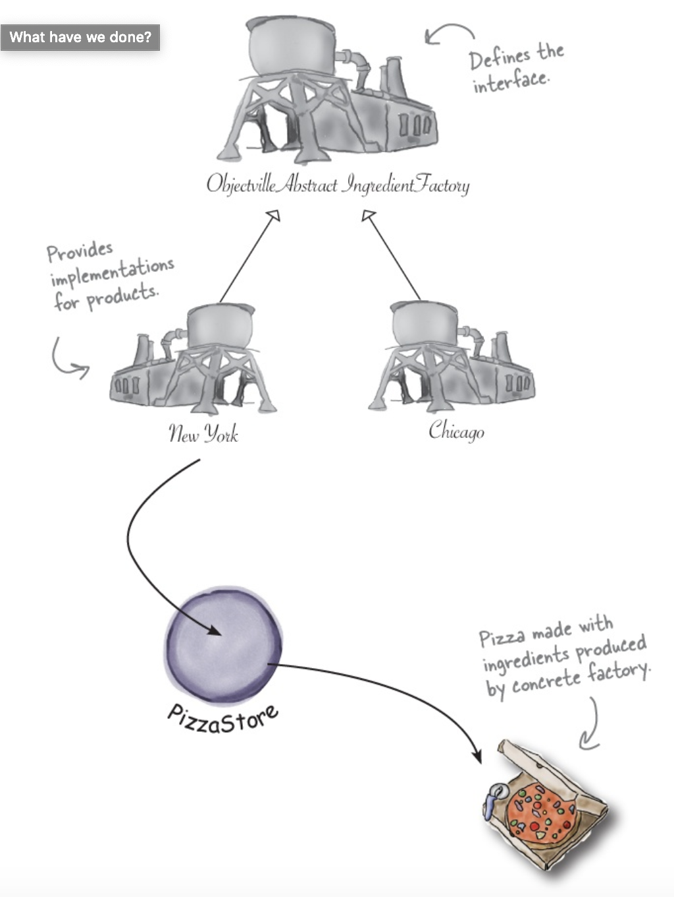
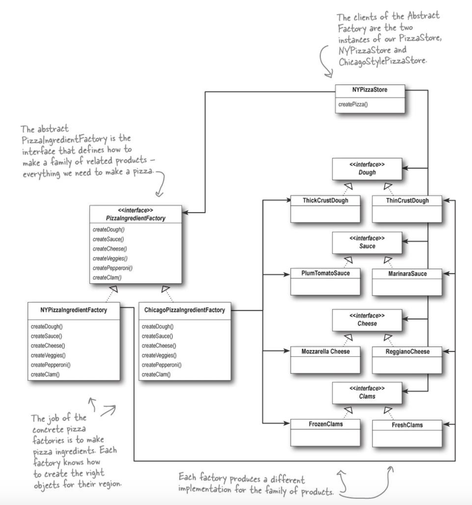

# 🍐🏭 Factory Pattern (2) - Abstract Factory Pattern

*Assembled by GimunLee (2020-01-11)*

<br/>

## Goal

- Abstract Factory Pattern의 개념을 알 수 있다.
- Abstract Factory Pattern에 대해 설명할 수 있다.
- 팩토리 메소드 패턴과 추상 팩토리 패턴의 차이점에 대해 설명할 수 있다.

<br/>

## 피자가게 분점 문제점

각 분점에서 피자의 재료를 다른 것을 사용하기 시작했습니다. 이렇게 서로 다른 종류의 재료들을 제공하기 위해 원재료군(families of ingredients)을 처리할 방법을 생각해 봐야 합니다. 

### 문제점

- 모든 피자는 같은 구성요소로 이루어지지만, 지역마다 각 구성요소를 다른 방식으로 구현합니다.
- 각 군(family)은 특정 형식의 반죽, 특정 형식의 소스, 치즈 그리고 해산물 토핑으로 구성됩니다. (그 외에도 야채나 향신료 같은 자잘한 것들이 있습니다.)
- 각 분점은 각각의 원재료군을 이룹니다. 각 지역마다 특정 형식의 재료로 구성되는 군을 구현해야합니다.

<br/>

## 원재료 공장 만들기

이제 원재료를 생산하기 위한 공장을 만들어 보겠습니다. 이 공장에서는 원재료군에 들어있는 각각의 원재료를 생산합니다. 즉, 반죽, 소스, 치즈 같은 걸 만들어야 합니다. 

우선 모든 원재료를 생산할 팩토리를 위한 인터페이스를 정의해보겠습니다.

- 각 재료별 생성 메소드를 정의합니다.
- 모든 팩토리 인스턴스에서 공통적으로 사용하는 부분이 있다면 인터페이스가 아닌 추상클래스로 만들어도 됩니다.

```java
public interface PizzaIngredientFactory {
  public Dough createDough();
  public Sauce createSauce();
  public Cheese createCheese();
  public Veggies[] createVeggies();
  public Pepperoni createPepperoni();
  public Clams createClam();
}
```

뉴옥 원재료 공장을 구현해보겠습니다. 이 공장에서는 마리나라 소스, 레지아노 치즈, 신선한 조개 등을 전문적으로 생산합니다.

```java
public class NYPizzaIngredientFactory implements PizzaIngredientFactory {
  public Dough createDough() {
    return new ThinCrustDough();
  }
  
  public Sauce createSauce() {
    return new MarinaraSauce();
  }
  
  public Cheese createCheese() {
    return new ReggianoCheese();
  }
  
  public Veggies[] createVeggies(){
  	Veggies veggies[] = { new Garlic(), new Onion(), new Mushroom(), new RedPepper() };
    return veggies;
  }
  
  public Pepperoni createPepperoni() {
    return new SlicedPepperoni();
  }
  
  public Clams createClam() {
    return new FreshClams();
  }
}
```

<br/>

## 피자 클래스 변경

팩토리 준비가 끝나고 이제 재료를 생산할 준비가 끝났습니다. Pizza 클래스에 팩토리에서 생산한 원재료만 사용하도록 코드를 고쳐야합니다. 우선 Pizza 추상 클래스에서 시작해보겠습니다.

```java
public abstract class Pizza {
  String name;
  Dough dough;
  Sauce sauce;
  Veggies veggies[];
  Cheese cheese;
  Pepperoni pepperoni;
  Clams clam;
  
  abstract void prepare(); // 이 부분에서 피자를 만드는데 필요한 재료들을 정돈하게 됩니다. 물론 모든 원재료는 원재료 팩토리에서 가져옵니다.
  
  void bake(){
    System.out.println("Bake for 25 minutes at 350");
  }
  
  void cut(){
    System.out.println("Cutting the pizza into diagonal slices");
  }
  
  void box(){
    System.out.println("Place pizza in official PizzaStore box");
  }
  
  void setName(String name){
    this.name = name;
  }
  
  String getName(){
    return name;
  }
  
  public String toString(){
    // 피자 이름을 출력하는 부분
  }
}
```

- prepare() 메소드를 제외한 다른 메소드들은 바뀌지 않습니다.

Pizza 추상 클래스 준비가 끝났으니 뉴옥풍 피자와 시카고풍 피자를 만들어야됩니다. 달라진 점은 원재료를 공장에서 바로 가져온다는 것 밖에 없습니다. 

팩토리 메소드 패턴을 이용한 코드를 만들었을 때, 다른 피자 클래스를 살펴보면 지역별로 다른 재료를 사용한다는 것만 빼면 다른점이 없습니다. 피자를 이루는 기본 요소가 반죽, 소스, 치즈라는 건 마찬가지니까요. 야채 피자나 조개 피자도 마찬가지입니다. 재료만 다를 뿐 준비 단계들을 똑같습니다.

따라서 피자마다 클래스를 지역별로 만들 필요가 없다는 결론을 내릴 수 있습니다. 지역별로 다른 점은 원재료 공장에서 커버해주니까요. 치즈 피자 코드를 구현해보겠습니다.

```java
public class CheesePizza extends Pizza {
  PizzaIngredientFactory ingredientFactory;
  
  // 이제 피자를 만들기 위해 원재료를 제공하는 공장이 필요합니다. 
  // 따라서 각 피자 클래스에서는 생성자를 통해서 팩토리를 전달 받습니다.
  public CheesePizza(PizzaIngredientFactory ingredientFactory) {
    this.ingredientFactory = ingredientFactory;  
  }
  
  void prepare(){
    System.out.println("Preparing " + name);
    dough = ingredientFactory.createDough();
    sauce = ingredientFactory.createSauce();
    cheese = ingredientFactory.createCheese();
  }
}
```

<br/>

## 올바른 재료 공장 사용하기

피자 가게를 다시 살펴보겠습니다.

```java
public class NYPizzaStore extends PizzaStore {
  
  protected Pizza createPizza(String item) {
    Pizza pizza = null;
    PizzaIngredientFactory ingredientFactory = new NYPizzaIngredientFactory();
    
    if(item.equals("cheese")){
    	pizza = new CheesePizza(ingredientFactory);
      pizza.setName("New York Style Cheese Pizza");
    }else if(item.equals("veggie")){
      pizza = new VeggiePizza(ingredientFactory);
      pizza.setName("New York Style Veggie Pizza");
    }else if(item.equals("clam")){
      pizza = new ClamPizza(ingredientFactory);
      pizza.setName("New York Style Clam Pizza");
    }else if(item.equals("pepperoni")){
      pizza = new PepperoniPizza(ingredientFactory);
      pizza.setName("New York Style Pepperoni Pizza");
    }
    return pizza;
  }
}
```

팩토리 메소드 패턴을 써서 만든 소스와 비교 추가


<br/>

## 지금까지 한 걸 정리해 봅시다.



추상 팩토리(Abstract Factory)라고 부르는 새로운 형식의 팩토리를 도입해서 서로 다른 피자에서 필요로 하는 원재료군을 생산하기 위한 방법을 구축했습니다. 

추상 팩토리를 통해서 제품군을 생성하기 위한 인터페이스를 제공할 수 있습니다. 이 인터페이스를 이용하는 코드를 만들면 코드를 제품을 생산하는 실제 팩토리와 분리시킬 수 있습니다. 이렇게 함으로써 (지역, 운영체제, 룩앤필 등) 서로 다른 상황별로 적당한 제품을 생산할 수 있는 다양한 팩토리를 구현할 수 있게 됩니다.

코드가 실제 제품하고 분리되어 있으므로 다른 공장을 사용하기만 하면 다른 결과를 얻을 수 있습니다.

<br/>

## 추상 팩토리 패턴 정의

이제 한 가지 팩토리 패턴을 더 배웠습니다. 제품군을 만들 때 쓸 수 있는 패턴입니다. 

**추상 팩토리 패턴 - 추상 팩토리 패턴에서는 인터페이스를 이용하여 서로 연관된, 또는 의존하는 객체를 구상 클래스를 지정하지 않고도 생성할 수 있습니다.**

추상 팩토리 패턴을 사용하면 클라이언트에서 추상 인터페이스를 통해서 일련의 제품들을 공급받을 수 있습니다. 이때, 실제로 어떤 제품이 생산되는지는 전혀 알 필요도 없습니다. 따라서 클라이언트와 팩토리에서 생산되는 제품을 분리시킬 수 있습니다. 

클래스 다이어그램을 통해서 어떤 식으로 돌아가는지 살펴봅시다.



이제 PizzaStore까지 포함시켜서 전체적인 다이어그램을 살펴봅시다.


<br/>

**추상 팩토리 패턴 뒤에는 팩토리 메소드 패턴이 숨어있는 건가요?**

추상 팩토리 패턴에서 메소드가 팩토리 메소드로 구현되는 경우도 종종 있습ㄴ디ㅏ. 추상 패토리가 원래 일련의 제품들을 생성하는 데 쓰일 인터페이스를 정의하기 위해 만들어진 거니까요. 그 인터페이스에 있는 각 메소드는 구상 제품을 생산하는 일을 맡고 있고, 추상 팩토리의 서브클래스를 만들어서 각 메소드의 구현을 제공합니다. 따라서 추상 팩토리 패턴에서 제품을 생산하기 위한 메소드를 구현하는 데 있어서 팩토리 메소드를 사용하는 것은 너무나도 자연스러운 일입니다.

<br/>

## Reference & Additional Resources

- HeadFirstDesignPattern
