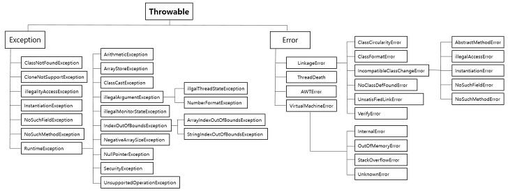
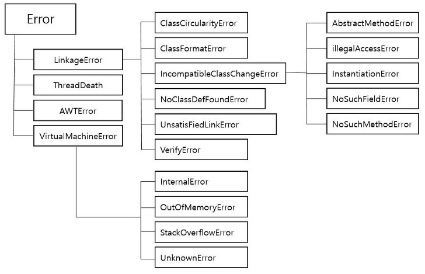
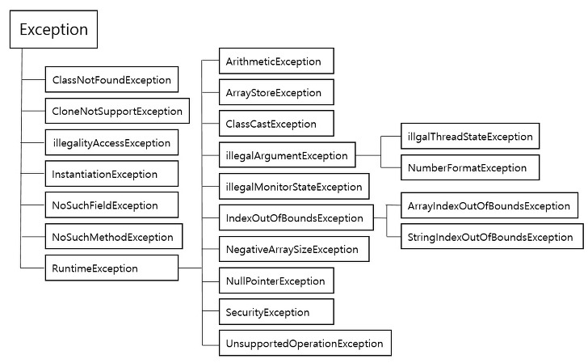

# Error & Exception

*Assembled by GimunLee (2019-11-19)*

<br>

## Goal

- Error와 Exception의 차이점에 대해 설명할 수 있다.
- Exception Handling을 할 수 있다.

<br>

## Abstract

Error와 Exception은 같다고 생각할 수도 있지만 사실 큰 차이가 있습니다.

**Error** 는 컴파일 시 문법적인 오류와 런타임 시 널포인트 참조와 같은 오류로 프로세스에 심각한 문제를 야기 시켜 프로세스를 종료 시킬 수 있습니다.

**Exception** 은 컴퓨터 시스템의 동작 도중 예기치 않았던 이상 상태가 발생하여 수행 중인 프로그램이 영향을 받는 것우로 예를 들면, 연산 도중 넘침에 의해 발생한 끼어들기 등이 이에 해당합니다.

프로그램이 실행 중 어떤 원인에 의해서 오작동을 하거나 비정상적으로 종료되는 경우를 프로그램 오류라 하고, 프로그램 오류에는 에러(error)와 예외(exception) 두 가지로 구분할 수 있습니다. 에러는 메모리 부족이나 스택오버플로우와 같이 발생하면 복구할 수 없는 심각한 오류이고, 예외는 발생하더라도 수습할 수 있는 비교적 덜 심각한 오류입니다. 이 예외는 프로그래머가 적절히 코드를 작성해주면 비정상적인 종류를 막을 수 있습니다.

Error의 상황을 미리 미연에 방지하기 위해서 Exception 상황을 만들 수 있으며, java에서는 try-catch문으로 Exception handling을 할 수 있습니다.

<br>

## Exception Handling

잘못된 하나로 인해 전체 시스템이 무너지는 결과를 방지하기 위한 기술적인 처리입니다. JAVA에서는 예외와 에러도 객체로 처리합니다.

예외가 주로 발생하는 원인

- 사용자의 잘못된 데이터 입력
- 잘못된 연산
- 개발자가 로직을 잘못 작성
- 하드웨어, 네트워크 오작동
- 시스템 과부하

<br>

## Throwable 클래스



Throwable 클래스는 예외처리를 할 수 있는 최상위 클래스입니다. Exception과 Error는 Throwable의 상속을 받습니다.

<br>

## Error (에러)



Error는 시스템 레벨에서 발생하여, 개발자가 어떻게 조치할 수 없는 수준을 의미합니다.

- OutOfMemoryError : JVM에 설정된 메모리의 한계를 벗어난 상황일 때 발생합니다. 힙 사이즈가 부족하거나, 너무 많은 class를 로드할때, 가용가능한 swap이 없을때, 큰 메모리의 native메소드가 호출될 때 등이 있습니다. 이를 해결하기위해 dump 파일분석, jvm 옵션 수정 등이 있습니다.

<br>

## Exception (예외)



예외는 개발자가 구현한 로직에서 발생하며 개발자가 다른 방식으로 처리가능한 것들로 JVM은 정상 동작합니다. 

<br>

## Exception의 2가지 종류

1. Checked Exception : 예외처리가 필수이며, 처리하지 않으면 컴파일되지 않습니다. JVM 외부와 통신(네트워크, 파일시스템 등)할 때 주로 쓰입니다.

   - RuntimeException 이외에 있는 모든 예외
   - IOException, SQLException 등

2. Unchecked Exception : 컴파일 때 체크되지 않고, Runtime에 발생하는 Exception을 말합니다.

   - RuntimeException 하위의 모든 예외
   - NullPointerException, IndexOutOfBoundException 등

<br>

## 대표적인 Exception Class

- NullPointerException : Null 레퍼런스를 참조할때 발생, 뭔가 동작시킬 때 발생합니다.
- IndexOutOfBoundsException : 배열과 유사한 자료구조(문자열, 배열, 자료구조)에서 범위를 벗어난 인덱스 번호 사용으로 발생합니다.
- FormatException : 문자열, 숫자, 날짜 변환 시 잘못된 데이터(ex. "123A" -> 123 으로 변환 시)로 발생하며, 보통 사용자의 입력, 외부 데이터 로딩, 결과 데이터의 변환 처리에서 자주 발생합니다.
- ArthmeticException : 정수를 0으로 나눌때 발생합니다.
- ClassCastException : 변환할 수 없는 타입으로 객체를 변환할 때 발생합니다.
- IllegalArgumentException : 잘못된 인자 전달 시 발생합니다.
- IOException : 입출력 동작 실패 또는 인터럽트 시 발생합니다.
- IllegalStateException : 객체의 상태가 매소드 호출에는 부적절한 경우에 발생합니다.
- ConcurrentModificationException : 금지된 곳에서 객체를 동시에 수정하는것이 감지될 경우 발생합니다.
- UnsupportedOperationException : 객체가 메소드를 지원하지 않는 경우 발생합니다.

<br>

## 주요 Method

- printStackTrace() : 발생한 Exception의 출처를 메모리상에서 추적하면서 결과를 알려줍니다. 발생한 위치를 정확히 출력해줘서 제일 많이 쓰며 void를 반환합니다.
- getMessage() : 한줄로 요약된 메세지를 String으로 반환해줍니다.
- getStackTrace() : jdk1.4 부터 지원, printStackTrace()를 보완, StackTraceElement[] 이라는 문자열 배열로 변경해서 출력하고 저장합니다.

<br>

## Exception Handling

JAVA에서 모든 예외가 발생하면 (XXX)Exception 객체를 생성합니다. 예외를 처리하는 방법에는 크게 2가지가 있습니다.

1. 직접 try ~ catch 를 이용해서 예외에 대한 최종적인 책임을 지고 처리하는 방식
2. throws Exception 을 이용해서 발생한 예외의 책임을 호출하는 쪽이 책임지도록 하는 방식 (주로 호출하는 쪽에 예외를 보고할 때 사용합니다.)

다른 메소드의 일부분으로 동작하는 경우엔 던지는 것을 추천합니다.

<br>

## 예외 잡기 (try ~ catch 구문)

로직 중에 예외가 발생할지도 모르는 부분에 try ~ catch 구문으로 보험 처리합니다.

- try 에는 위험한 로직이 들어가고, catch 에는 예외 발생 시 수행할 로직이 들어갑니다.
- try 중이라도 예외가 발생한 다음의 코드들은 실행되지 않으며 catch 구문으로 넘어갑니다.
- catch 구문은 else if 처럼 여러개 쓸 수 있습니다. 
- finally 는 마지막에 실행하고 싶은 로직이 들어가며, 대표적으로 `.close()` 가 있습니다.

<br>

## 예외 던지기 (throws 구문)

예외 처리를 현재 메소드가 직접 처리하지 않고 호출한 곳에다가 예외의 발생 여부를 통보합니다. 호출한 메소드는 이걸 또 던질건지 직접 처리할 건지 정해야합니다. (return보다 강력합니다.)

```java
public class ThrowsEx {
    public void call_A() throws Exception {
        call_B();
    }

    private void call_B() throws Exception {
        call_C();
    }

    private void call_C() throws Exception {
        System.out.println(1 / 0);
    }

    public static void main(String[] args) throws Exception {
        ThrowsEx test = new ThrowsEx();
        test.call_A();
    }
}
```

실행 결과는 아래와 같습니다.

```
Exception in thread "main" java.lang.ArithmeticException: / by zero
    at exception.ThrowsEx.call_C(ThrowsEx.java:13)
    at exception.ThrowsEx.call_B(ThrowsEx.java:9)
    at exception.ThrowsEx.call_A(ThrowsEx.java:5)
    at exception.ThrowsEx.main(ThrowsEx.java:18)
```

<br>

## Reference & Additional Resources

-  https://drcarter.tistory.com/153 
-  https://movefast.tistory.com/12?category=765934 
-  https://sjh836.tistory.com/122


