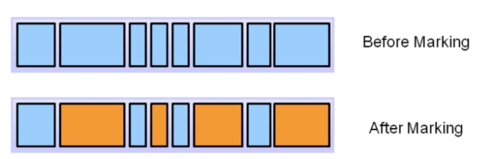
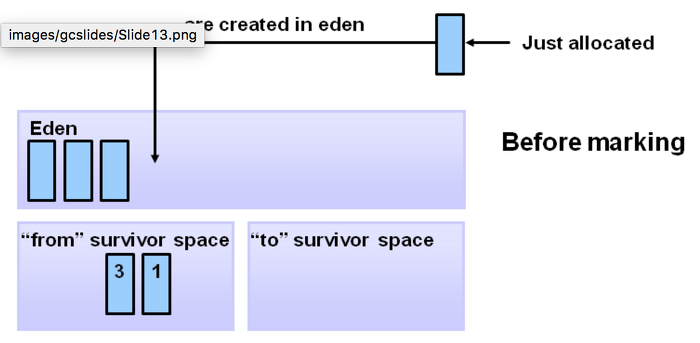
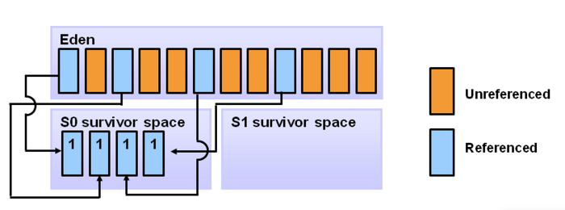
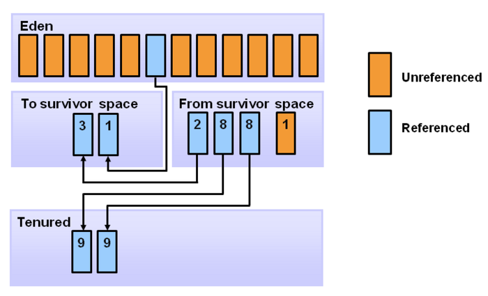

# Garbage Collection

*Assembled by GimunLee (2019-10-28)*

<br>

## Goal

- Garbage Collection의 역할에 대해 설명할 수 있다.
- Garbage Collection의 메모리 해제 과정을 3단계로 설명할 수 있다.
- Generational Gabage Collection에 대해 설명할 수 있다.
- Generational Garbage Collection 과정에 대해 설명할 수 있다.
- Minor GC와 Major GC의 차이점에 대해 설명할 수 있다.

<br>

## Abstract

C/C++ 프로그래밍을 할 때 메모리 누수(Memory Leak)를 막기 위해 객체를 생성한 후 사용자하지 않는 객체의 메모리를 프로그래머가 직접 해제 해주어야 했습니다. 하지만, JAVA에서는 JVM(Java Virtual Machine)이 구성된 JRE(Java Runtime Environment)가 제공되며, 그 구성 요소 중 하나인 Garbage Collection(이하 GC)이 자동으로 사용하지 않는 객체를 파괴합니다.

GC에 대해서 알아보기 전에 'stop-the-world'라는 용어를 알아야합니다. 'stop-the-world'란, GC를 실행하기 위해 JVM이 애플리케이션 실행을 멈추는 것입니다. 어떤 GC 알고리즘을 사용하더라도 'stop-the-world'는 발생하게 되는데, 대개의 경우 GC 튜닝은 이 'stop-the-world' 시간을 줄이는 것이라고 합니다.

GC를 해도 더이상 사용 가능한 메모리 영역이 없는데 계속 메모리를 할당하려고 하면, OutOfMemoryError가 발생하여 WAS가 다운될 수도 있습니다. 행(Hang) 즉, 서버가 요청을 처리 못하고 있는 상태가 됩니다.

따라서 규모 있는 JAVA 애플리케이션을 효율적으로 개발하기 위해서는 GC에 대해 잘 알아야한다고 합니다. 이번에는 GC에 대해 간단하게 알아보겠습니다.

<br>

## Garbage Collection

C/C++ 언어와 달리 자바는 개발자가 명시적으로 객체를 해제할 필요가 없습니다. 자바 언어의 큰 장점이기도 합니다. 사용하지 않는 객체는 메모리에서 삭제하는 작업을 GC라고 부르며 JVM에서 GC를 수행합니다. 

기본적으로 JVM의 메모리는 총 5가지 영역(class, stack, heap, native method, PC)으로 나뉘는데, GC는 힙 메모리만 다룹니다. 

일반적으로 다음과 같은 경우에  GC의 대상이 됩니다.
1. 객체가 NULL인 경우 (ex. String str = null)

2. 블럭 실행 종료 후, 블럭 안에서 생성된 객체

3. 부모 객체가 NULL인 경우, 포함하는 자식 객체

GC는 ```Weak Generational Hypothesis``` 에 기반합니다. 우선 GC의 메모리 해제 과정에 대해 살펴보겠습니다.

<br>

## GC의 메모리 해제 과정

1. Marking 

   

   - 프로세스는 마킹을 호출합니다. 이것은 GC가 메모리가 사용되는지 아닌지를 찾아냅니다. 참조되는 객체는 파란색으로, 참조되지 않는 객체는 주황색으로 보여집니다. 모든 오브젝트는 마킹 단계에서 결정을 위해 스캔되어집니다. 모든 오브젝트를 스캔하기 때문에 매우 많은 시간을 소모하게 됩니다.

2. Normal Deletion

   

   - 참조되지 않는 객체를 제거하고, 메모리를 반환합니다. 메모리 Allocator는 반환되어 비어진 블럭의 참조 위치를 저장해 두었다고 새로운 오브젝트가 선언되면 할당되도록 합니다.

3. Compacting

   

   - 퍼포먼스를 향상시키기 위해, 참조되지 않는 객체를 제거하고 또한 남은 참조되어지는 객체들을 묶습니다. 이들을 묶음으로서 공간이 생기므로 새로운 메모리 할당 시에 더 쉽고 빠르게 진행 할 수 있습니다.

<br>

## Generational Garbage Collection 배경

위와 같이 모든 객체를 ```Mark & Compact``` 하는 JVM은 비효율적입니다. 다음과 같은 그래프를 보시겠습니다.


Y축은 할당된 바이트의 수이고 X축은 바이트가 할당될 때의 시간입니다. 보시다시피 시간이 갈수록 적은 객체만이 남습니다. 위와 같은 그래프에 기반한 것이 Weak Generational Hypothesis 입니다.

<br>

## Weak Generational Hypothesis

신규로 생성한 객체의 대부분은 금방 사용하지 않는 상태가 되고, 오래된 객체에서 신규 객체로의 참조는 매우 적게 존재한다는 가설입니다.  

이 가설에 기반하여 자바는 Young 영역과 Old 영역으로 메모리를 분할하고, 신규로 생성되는 객체는 Young 영역에 보관하고, 오랫동안 살아남은 객체는 Old 영역에 보관합니다.

<br>

## Generational Gabage Collection


1. Young 영역(Yong Generation 영역)
   
   새롭게 생성한 객체의 대부분이 여기에 위치합니다. 대부분의 객체가 금방 접근 불가능 상태가 되기 때문에 매우 많은 객체가 Young 영역에 생성되었다가 사라집니다. 이 영역에서 객체가 사라질때 **Minor GC** 가 발생한다고 말합니다.

2. Old 영역(Old Generation 영역)
   
   접근 불가능 상태로 되지 않아 Young 영역에서 살아남은 객체가 여기로 복사됩니다.  대부분 Young 영역보다 크게 할당하며, 크기가 큰 만큼 Young 영역보다 GC는 적게 발생합니다. 이 영역에서 객체가 사라질 때 **Major GC(혹은 Full GC)** 가 발생한다고 말합니다.

3. Permanet 영역
   
   Method Area라고도 합니다. JVM이 클래스들과 메소드들을 설명하기 위해 필요한 메타데이터들을 포함하고 있습니다.  JDK8부터는 PermGen은 Metaspace로 교체됩니다.

<br>

## Generational Garbage Collection 과정

1. 어떠한 새로운 객체가 들어오면 Eden Space에 할당합니다. 

   

   ---

2. Eden space가 가득차게 되면, minor garbage collection이 시작됩니다.

   

   ---

3. 참조되는 객체들은 첫 번째 survivor(S0)로 이동되어지고, 비 참조 객체는 Eden space가 clear 될 때 반환됩니다.

   

   ---

4. 다음 minor GC 때, Eden space에서는 같은 일이 일어납니다. 비 참조 객체는 삭제되고 참조 객체는 survivor space로 이동하는 것 입니다. 그러나 이 케이스에서 참조 객체는 두 번째 survivor space로 이동하게 됩니다. 게다가 최근 minor GC에서 첫 번째 survivor space로 이동된 객체들도 age가 증가하고 S1 공간으로 이동하게 됩니다. 한번 모든 surviving 객체들이 S1으로 이동하게 되면 S0와 Eden 공간은 Clear 됩니다. 주의해야할 점은 이제 우리는 다른 aged 객체들을 서바이버 공간에 가지게 되었다는 것입니다.

   

   ---

5. 다음 minor GC 때, 같은 과정이 반복 됩니다. 그러나 이 번엔 survivor space들은 switch 됩니다. 참조되는 객체들은 S0로 이동합니다. 살아남은 객체들은 aged되죠. 그리고 Eden과 S1 공간은 Clear 됩니다.

   

   ---

6. 아래 그램은 promotion을 보여줍니다. minor GC 후 aged 오브젝트들이 일정한 age threshold(문지방)을 넘게 되면 그들은 young generation에서 old로 promotion 되어집니다. 여기서는 8을 예로 들었습니다.

   

   ---

7. minor GC가 계속되고 계속해서 객체들이 Old Generation으로 이동됩니다.

   

   ---

8. 아래 그림은 전 과정을 보여주고 있습니다. 결국 major GC가 old Generation에 시행되고, old Generation은 Clear 되고, 공간이 Compact 되어집니다.

   

<br>

## Conclusion

이외에도 정말 많은 내용이 있지만, 간단하게나마 GC의 개념과 작동원리에 대해 알아보았습니다. 개발자 기술 면접에서도 종종 나오니 이번에 확실하게 학습해두면 도움이 많이 될 것 같습니다.

<br>

## Reference & Additional Resources

- https://d2.naver.com/helloworld/1329 
- https://118k.tistory.com/817
- https://advenoh.tistory.com/14 
- https://itmining.tistory.com/24#recentComments 

