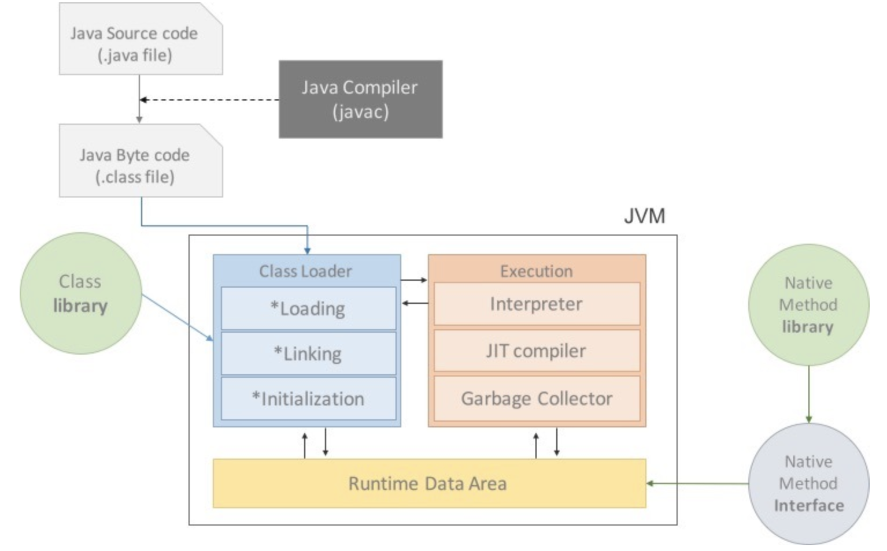
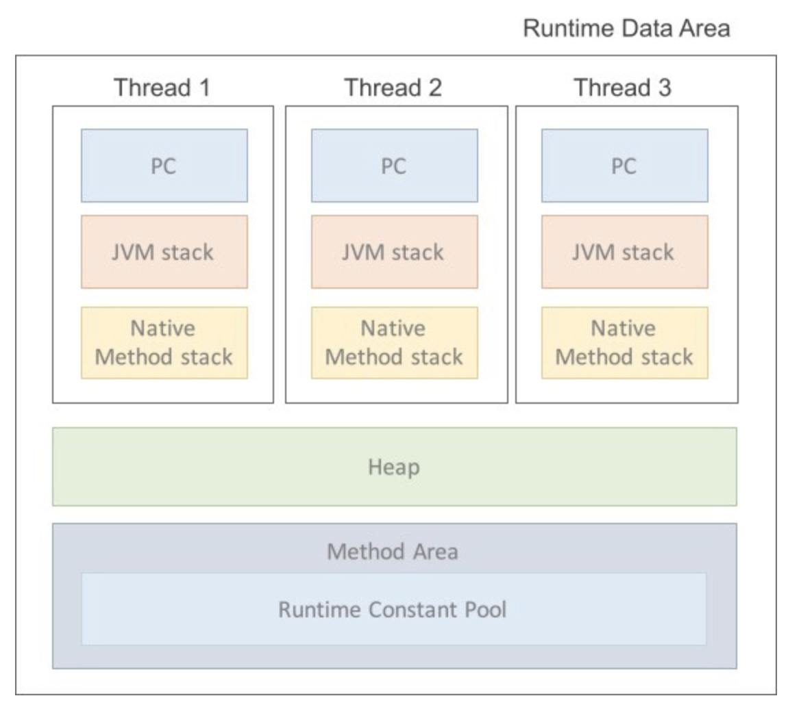

# JVM & 메모리 구조

*Assembled by Anna (2019-11-29)*

 

## Goal

- JVM의 특징에 대해 이해할 수 있다.
- JVM의 구조에 대해 이해할 수 있다.
- JVM의 메모리 구조를 알 수 있다.

 

## Introduction

JVM 은 Java Virtual Machine 으로 Java를 OS에 독립적으로 실행될 수 있게 하는 주체입니다.

이번 자료에서는 JVM의 특징과 구조에 대해서 파악할 것입니다.

 

## What is JVM

### JVM 의 특징

1. 컴파일된 바이트 코드를 기계가 이해할 수 있는 기계어로 변환
2. 스택 기반의 가상머신
3. 메모리 관리와 GC를 수행

 

### JVM 의 구성

* #### Class Loader

  `.java` 파일은 컴파일 되어 `.class` 의 바이트 코드로 전환됩니다. 이러한 바이트 코드는 JVM의 Class Loader로 진입하게 됩니다. 그 후, 링크를 통해 배치하는 작업을 수행합니다.

  * 컴파일타임이 아닌 런타임에 클래스 파일을 참조
  * 사용되지 않는 클래스들을 메모리에서 삭제하고, jar파일 내에 저장된 클래스들을 JVM위에 탑재합니다.
  * Runtime Data Area 에 바이트 코드 배치

* #### Execution Engine

  실행시키는 역할을 수행합니다. `.class` 들은 기계가 바로 수행할 수 없어, 실행 엔진을 통해 JVM 내부에서 실행 가능한 기계어로 변형된 후 실행되는데, 변형되는 과정은 아래 두 가지 방식을 사용하게 됩니다.

  * **Interpreter**

    명령어 단위로 읽어서 실행하는 인터프리터. 한 줄 씩 수행하기 때문에 느리다는 단점이 있습니다.

  * **JIT Compiler (Just-In-Time)**

    `인터프리터 + 컴파일러` 의 형태입니다.

    바이트코드 전체를 컴파일하여 네이티브 코드로 변경하고, 캐시에 저장합니다. 그렇기 때문에 한 번 컴파일된 코드는 빠르게 수행하게 됩니다.

    그러나, JIT컴파일러의 컴파일 과정은 인터프리팅보다 오래걸리므로 JIT 컴파일러를 사용하는 JVM들은 일정 정도를 넘을 정도로 수행되는 메서드들에 대해 컴파일을 수행합니다.

* #### GC

  Heap 영역에 배치된 객체들을 관리하는 모듈입니다. 자세한 동작 원리는 [이곳](<https://github.com/GimunLee/tech-refrigerator/blob/master/Language/JAVA/Garbage%20Collection.md#garbage-collection>) 에서 확인하실 수 있습니다.

* #### Runtime Data Area

  프로그램을 수행하기 위해 OS로부터 할당받은 메모리 영역을 의미합니다. 간단하게 Java 메모리 공간이라고도 합니다.

  

  * ##### PC Register

    JVM은 스택 기반의 가상 머신으로, CPU에 직접 접근하지 않고 Stack에서 Operand(주소)를 뽑아내 가져옵니다. 가져온 Operand는 PC Register에 저장됩니다.

    따라서, 현재 어떤 명령을 실행해야할 지에 대한 기록을 담당합니다.

  * ##### Native Method Stacks

    Java 이외의 언어에 제공되는 Method의 정보가 저장되는 공간입니다. Java Native Interface를 통해 바이트 코드로 저장됩니다. 일반 프로그램과 마찬가지로 Kernel이 자체적으로 Stack을 잡아 독자적으로 프로그램을 실행시키는 영역입니다.

  * ##### JVM Stacks

    호출된 메서드의 파라미터, 지역 변수, 리턴 값 및 연산값 등이 저장되는 영역입니다. 프로그램 실행시 임시로 할당되었다가 메서드를 빠져나가게 되면 소멸되는 특성의 데이터들이 저장되는 영역입니다.

    메서드 호출 시마다 스택에 각각의 스택 프레임이 생성이 되고 메서드 수행이 끝나면 스택 포인트에서 해당 프레임이 제거됩니다.

  * ##### Heap

    GC의 대상이 되는 영역입니다. 객체를 동적으로 생성하게 되면 인스턴스가 Heap 영역의 메모리에 할당됩니다. 단, 레퍼런스 변수의 경우, Heap에 인스턴스가 저장되는 것이 아닌 포인터가 저장됩니다.

  * ##### Method Area

    클래스 정보를 처음 메모리에 올릴 때 초기화되는 대상을 저장하기 위한 영역입니다. 메소드 바이트코드가 올라가게 되는데, 컴파일된 바이트코드는 대부분이 메소드 바이트코드로 거의 모든 바이트코드가 올라간다고 봐도 될 것 같다고 합니다.

    올라가는 정보는 다음과 같습니다.

    1. **Field Information**

       멤버변수에 대한 정보 (이름, 타입, 접근 지정자 등)

    2. **Method Information**

       메서드에 대한 정보 (이름, 리턴타입, 파라미터, 접근 지정자 등)

    3. **Type Information**

       Class 인지 Interface 인지? Type의 속성, 이름, super class의 이름

    또한, Method Area 에는 상수형을 저장하고 중복을 막는 **Runtime Constant Pool** 이 존재합니다.

   

  🌟 Java 는 멀티쓰레드 환경으로 모든 쓰레드는 **Heap, Method Area** 를 공유합니다.

 

## 자주 묻는 질문

* String에서 `==` 을 쓸 때와 `.equals()` 를 쓰는 이유를 설명해보시오.
* `String s1 = "aaa";` 와 `String s2 = new String("aaa");` 의 차이는 무엇입니까?
* `.java` 파일이 컴파일 되어 실행되는 과정을 설명해보시오.

 

## Conclusion

아무래도 Java 의 기초가 되는 부분이다 보니 기술 면접 시 객체 생성이나, GC, Constant Pool에 관한 질문이 많이 들어오는 것 같았습니다. JVM에 대한 이해를 바탕으로 자주 묻는 질문에 대한 답변을 준비해 보는 것도 좋을 것 같습니다.

 

## Reference & Additional Resources

-  <https://asfirstalways.tistory.com/158>
-  <https://www.holaxprogramming.com/2013/07/16/java-jvm-runtime-data-area/>

##### 