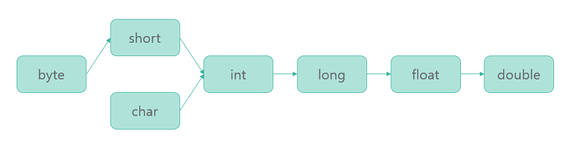
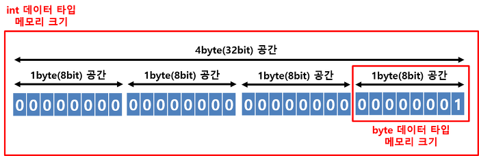
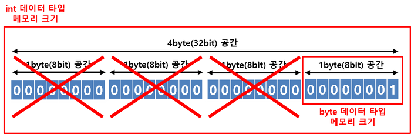

# Promotion & Casting

*Assembled by GimunLee (2019-11-19)*

<br>

## Goal

- Promotion에 대해 설명할 수 있다.
- Casting에 대해 설명할 수 있다.
- 형변환할 때 발생할 수 있는 에러에 대해 설명할 수 있다.

<br>

## 데이터 타입 형변환 (타입변환)

Java에서 연산은 "2(byte 데이터 타입) + 3(byte 데이터 타입)" 과 같이 동일한 데이터 타입에서 가능합니다. 하지만, 프로그램을 만들다 보면 "2(byte 데이터 타입) + 3.5(double 데이터 타입)"과 같이 서로 다른 데이터 타입끼리의 연산이 필요할 때가 있습니다. 

이럴경우 변수의 데이터 타입을 바꿔주는 작업이 필요한데, 이것이 데이터 타입의 형변환(타입변환)입니다. 이러한 형변환(타입변환)에는 크게 **자동 형변환(Promotion)** 과 **강제 형변환(Casting)** 이 있습니다. 또 다른말로 자동 형변환은 묵시적 타입 변환, 강제 형변환은 명시적 타입 변환이라고도 합니다.

<br>

## Promotion (자동 형변환, 묵시적 형변환)

자동 형변환(Promotion)은 프로그램 실행 도중에 자동적으로 형변환(타입변환)이 일어나는 것을 말합니다. 또한, 자동 형변환(Promotion)은 작은 메모리 크기의 데이터 타입을 큰 메모리 크기의 데이터 타입으로 변환하는 행위를 말합니다.

```java
byte a = 10; // 정수 10을 byte 데이터 타입의 변수인 a에 저장
int b = a;   // byte 데이터 타입의 변수인 a를 int 데이터 타입의 변수인 b에저장
```

위에 작성한 예시처럼 작은 메모리 크기의 데이터 타입(byte 데이터 타입)에서 큰 메모리 크기의 데이터 타입(int 데이터 타입)에 값을 저장하면, 별다른 문법 없이 형변환(타입변환)이 일어납니다. 이러한 형변환(타입변환)을 "자동 형변환(Promotion)"이라고 합니다

자동 형변환(Promotion)이 이루어지는 순서를 알아보겠습니다.



보시면, long 데이터 타입의 메모리 크기는 8byte이고, float 데이터 타입의 메모리 크기는 4byte인데, long 데이터 타입에서 float 데이터 타입으로 자동 형변환(Promotion)이 가능합니다. 그 이유는 표현할 수 있는 값의 범위가 float가 더 크기 때문입니다. 

주의할 점은 메모리 크기가 큰 데이터 타입이라도, 타입 범위를 포함하지 못한다면 자동 형변환(Promotion) 이 불가능합니다. 

- byte 데이터 타입 -> char 데이터 타입 자동 형변환 불가
- float 데이터 타입 -> long 데이터 타입 자동 형변환 불가

<br>

## Casting (강제 형변환, 명시적 형변환)

특정 조건을 갖추지 못했지만, 형변환을 하고 싶을때 사용하는 것이 Casting (강제 형변환)입니다.

```java
int intValue = 1;
byte byteValue = intValue;
```

위의 경우 intValue에 저장된 1이라는 값은 byte 데이터 타입에도 저장 가능한 값입니다. 그렇지만, 위 코드를 실행하면 컴파일 에러가 발생합니다. 그 이유는 저장될 값 1에 상관없이 int 데이터 타입이 byte 데이터 타입보다 메모리 크기가 크기 때문입니다. 그림으로 보자면,



이와 같은 그림이 나옵니다. int 데이터 타입에 저장된 정수 1의 값은 실제 메모리에 저장될 때 00000000 00000000 00000000 00000001 의 값을 가집니다. 이 값을 byte 데이터 타입에 끝에 1byte(00000001) 영역만 넣자니 앞에있는 3byte (00000000 00000000 00000000) 값이 날아갑니다. 그림으로 보면 이렇습니다.



앞에 3byte의 공간을 삭제하는 시점에서 많은 데이터가 날아가 정상적인 값이 저장될 수 없을 것입니다. 이와 같이 메모리 크기가 큰 int 데이터 타입에서 메모리 크기가 작은 byte 데이터 타입으로 자동 형변환(Promotion)이 된다면, 정상적이지 않은 값이 나올 수 있기 때문에 Java에서 자동 형변환(Promotion)을 하지 않습니다. 하지만, 우리가 형변환 하려는 정수 값은 1 이므로 byte 데이터 타입 범위 안에 충분히 들어가는 값입니다. 우린 그걸 머릿속으로 알고 있기 때문에 byte 데이터 타입으로 변환된다 하더라도 값이 정상적일 거라고 판단할 수 있습니다. 이럴 때 강제 형변환은 아래와 같이 해주시면 됩니다.

```java
int intValue = 1;
byte byteValue = (byte) intValue;
```

<br>

## 형변환 연산

+, -, *, / 과 같은 기본적인 사칙연산은 같은 타입의 피연산자 간에만 수행되기 때문에 서로 다른 데이터 타입의 피연산자가 있을 경우 두 피연산자 중 크기가 큰 타입으로 자동 형변환(Promotion)된 후 연산이 수행됩니다. 예를 들어 int 데이터 타입의 피연산자와 double 타입의 피연산자를 덧셈하면 int 데이터 타입의 피연산자가 double 데이터 타입으로 자동 형변환(Promotion)되고 연산이 수행됩니다. 연산의 결과도 double 데이터 타입이 됩니다.

```java
int intValue = 10;
double doubleValue = 5.5;
double result = intValue + doubleValue; 
// intValue 변수값과 doubleValue 변수값을 더해서 double 타입의 result 변수에 저장
```

만약 int 데이터 타입의 연산 결과를 얻고 싶다면, 강제 형변환(Casting)를 통해 아래와 같이 작성해주시면 됩니다.

```java
int intValue = 10;
double doubleValue = 5.5;
int result = intValue + (int) doubleValue;
// intValue 변수값과 doubleValue변수값을 더해서 int 타입의 result 변수에 저장
```

<br>

## Reference & Additional Resources

-  https://m.blog.naver.com/PostView.nhn?blogId=haejoon90&logNo=220781157092&proxyReferer=https%3A%2F%2Fwww.google.com%2F 
-  https://stage-loving-developers.tistory.com/8?category=257686 
-  https://stage-loving-developers.tistory.com/8 

