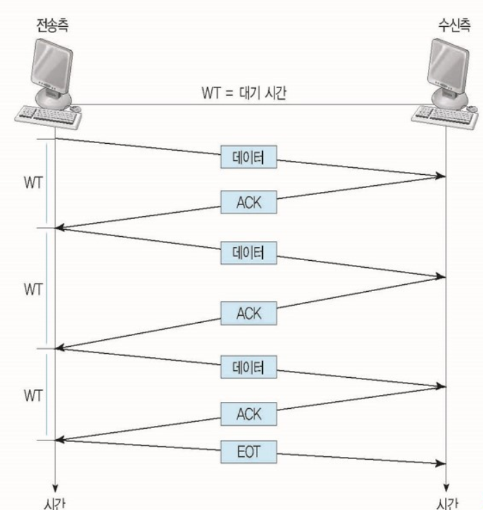
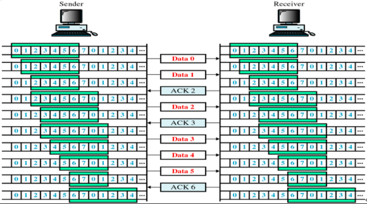
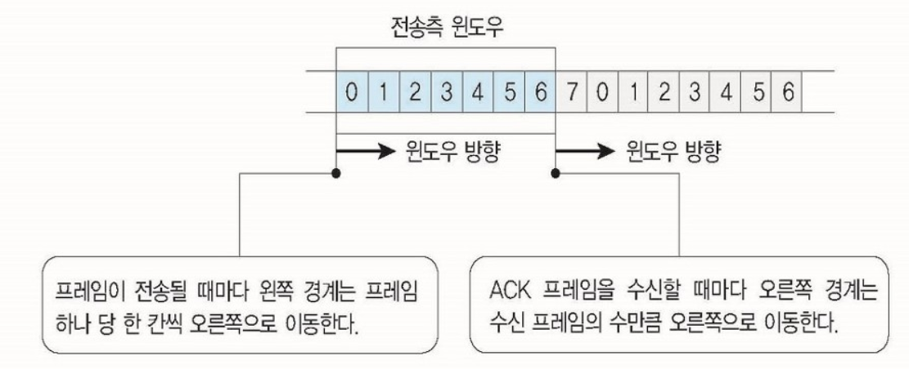
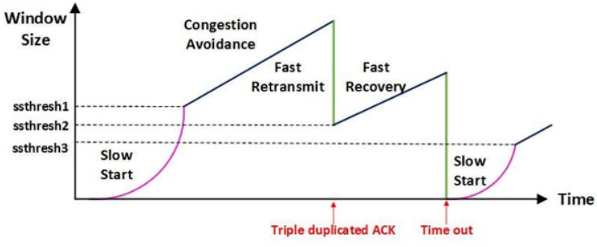
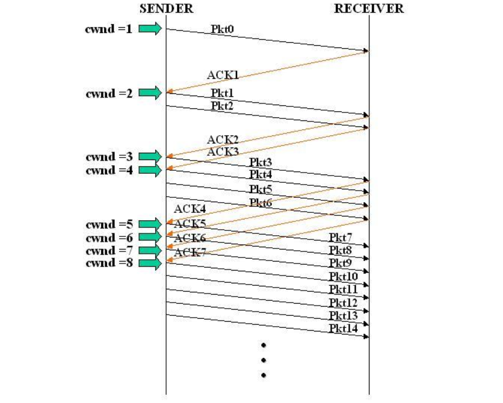
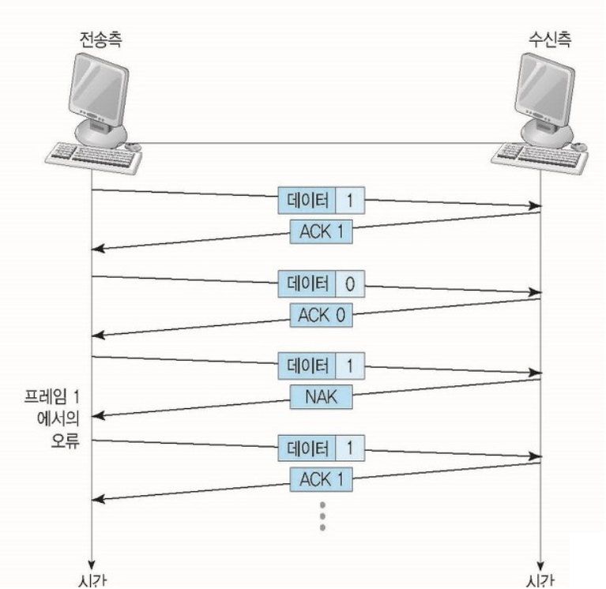
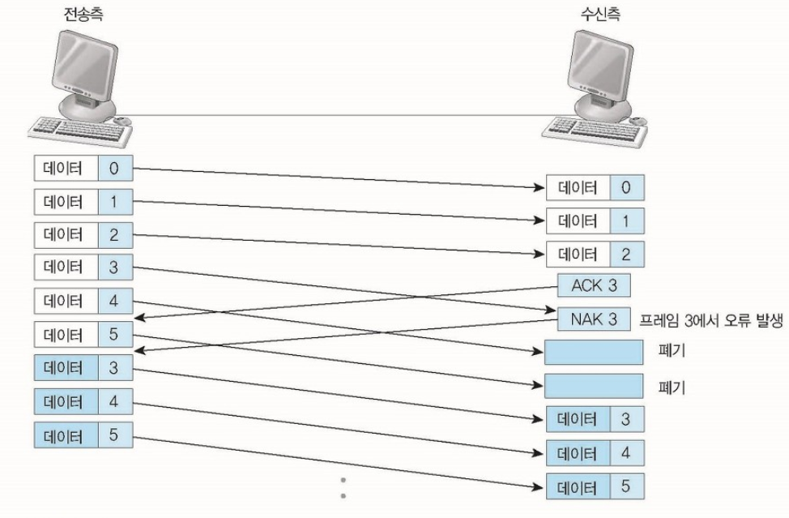
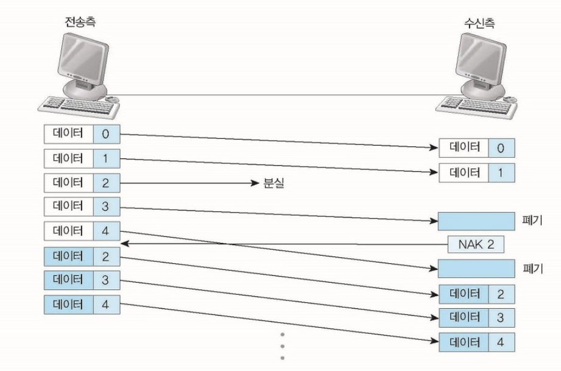
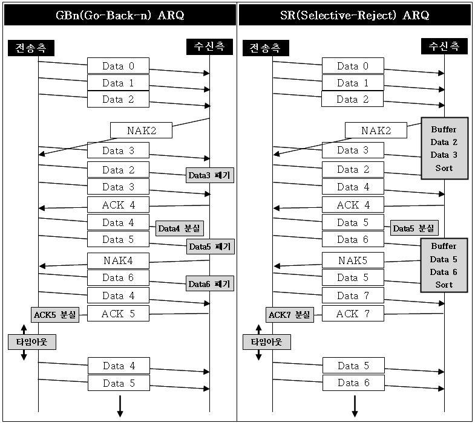
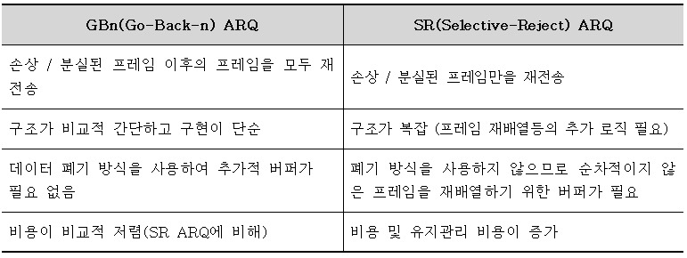

# 흐름제어 & 혼잡제어 & 오류제어

*Assembled by GimunLee (2019-12-04)*

 

## Goal

- 각 제어방식에 대해 설명할 수 있다.
- 각 제어방식에서 사용하는 기법에 대해 설명할 수 있다.
- 오류제어가 일어나는 경우와 해결 방법에 대해 설명할 수 있다.
- GBn ARQ 기법과 SR ARQ 기법의 차이점을 설명할 수 있다.

 

## Introduction

 TCP의 가장 큰 특징은 **신뢰성** 입니다. 이러한 신뢰성을 보장해주는 방법인 `흐름 제어` , `혼잡 제어` , `오류 제어` 에 대해 알아보도록 하겠습니다.

 

## 흐름제어 (Flow Control)

**송신(호스트) <> 수신(호스트)**

흐름제어는 `송신측(sender)와 수신측(receiver)의 데이터 처리 속도 차이` 를 해결하기 위한 기법으로, 수신측이 패킷(packet)을 지나치게 많이 받지 않도록 조절하는 것입니다. 기본 개념은 수신측이 송신측에게 현재 자신의 상태를 피드백(feedback)하는 것입니다.

만약 **송신측 전송량 > 수신측 처리량** 이라면, 전송된 패킷은 수신측의 큐를 넘어서 손실될 문제가 발생할 수 있기 때문에 **송신측의 패킷 전송량을 제어하게 됩니다.** 즉, 수신측에서 제한된 저장 용량을 초과한 이후에 도착하는 데이터는 손실 될 수 있으며, 만약 손실 된다면 불필요하게 응답과 데이터 전송이 송/수신측 간에 빈번이 발생합니다.

흐름제어 방법에는 `Stop and Wait` 와 `Sliding Window` 가 있으며, Stop and Wait부터 알아보겠습니다.

 

## Stop and Wait

Stop and Wait는 송신측에서 매번 전송한 패킷에 대해 수신측의 확인 응답(ACK)을 받아야만, 그 다음 패킷을 전송하는 방법입니다.

 구조가 간단한 대신, 하나를 주고 하나를 받기 때문에 **비효율적인 방식입니다.**

 

## Sliding Window 

수신측에서 설정한 윈도우 크기만큼 송신측에서 확인 응답없이 세그먼트를 전송할 수 있게 하여 데이터 흐름을 동적으로 조절하는 제어기법입니다. **즉, Sliding Window를 통하여 송신측 버퍼의 범위는 수신측의 여유 버퍼 공간을 반영하여 동적으로 바뀜으로써 흐름제어를 수행합니다.**

- Window는 전송, 수신 스테이션 양쪽에서 만들어진 `버퍼(Buffer)`의 크기입니다.
- Window Size = (가장 최근 ACK로 응답한 프레임의 수) - (이전에 ACK 프레임을 보낸 프레임의 수)
- `Sliding Window 기법` 은 `Stop and Wait 기법` 의 비효율성을 개선한 기법입니다.
- ACK 프레임을 수신하지 않더라도 여러 개의 프레임을 연속적으로 전송할 수 있습니다.

 

## Sliding Window 동작 방식

Window에 포함되는 패킷을 전송하고, 그 패킷들의 전달이 확인되는대로 이 Window를 옆으로 옮김으로써 그 다음 패킷들을 전송합니다. TCP/IP를 사용하는 모든 호스트들은 송신하기 위한 것과 수신하기 위한 2개의 Window를 가지고 있습니다. 호스트들은 실제 데이터를 보내기 전에 `3 way handshaking` 을 통해 수신 호스트의 `receive window size` 에 자신의 `send window size` 를 맞추게 됩니다.

- 전송측 윈도우

  

- 수신측 윈도우

  

 

## 혼잡제어 (Congestion Control)

**송신(호스트) <> 라우터(네트워크)**

혼잡제어는 `송신측의 데이터 전달과 네트워크의 데이터 처리 속도 차이` 를 해결하기 위한 기법입니다. 송신측의 데이터는 지역망이나 인터넷으로 연결된 대형 네트워크를 통해 전달됩니다. 

하지만 이러한 네트워크 상의 라우터가 항상 한가로운 상황은 아닙니다. 만약 한 라우터에게 데이터가 몰릴 경우(혼잡할 경우), 라우터는 자신에게 온 데이터를 모두 처리할 수 없습니다. 그렇게 되면 호스트들은 또 다시 재전송을 하게 되고 결국 혼잡을 가중시켜 오버플로우나 데이터 손실을 발생시킵니다. **따라서, 이러한 네트워크의 혼잡을 피하기 위해 송신측에서는 보내는 데이터의 전송 속도를 강제로 줄이게 되는데, 이러한 작업을 혼잡제어라고 합니다.** 

흐름제어가 송신측과 수신측 사이의 전송 속도를 다루는데 반해, 혼잡제어는 호스트와 라우터를 포함한 보다 넓은 관점에서 전송 문제를 다루게 됩니다.

 

## 혼잡제어 방법

#### 1. AIMD (Additive Increase /  Multiplicative Decrease)

합 증가 / 곱 감소라고도 부르며, 처음에 패킷을 하나씩 보내고 이것이 문제없이 도착하면 Window 크기(단위 시간 내에 보내는 패킷의 수)를 1씩 증가시켜가며 전송하는 방법입니다.

하지만, 패킷 전송에 실패하거나 일정 시간을 넘으면 패킷의 보내는 속도를 **절반** 으로 줄입니다. 공평한 방식으로 여러 호스트가 한 네트워크를 공유하고 있으면 나중에 진입하는 쪽이 처음에는 불리하지만, 시간이 흐르면 평형상태로 수렴하게 되는 특징이 있습니다.

문제점은 초기에 네트워크의 높은 대역폭을 사용하지 못하여 오랜 시간이 걸리게 되고, 네트워크가 혼잡해지는 상황을 미리 감지하지 못합니다. `즉, 네트워크가 혼잡해지고 나서야 대역폭을 줄이는 방식입니다.`

#### 2. Slow Start (느린 시작)

AIMD 방식이 네트워크의 수용량 주변에서는 효율적으로 작동하지만, 처음에 전송 속도를 올리는데 시간이 오래 걸리는 단점이 존재했습니다.

Slow Start 방식은 AIMD와 마찬가지로 패킷을 하나씩 보내면서 시작하고, 패킷이 문제없이 도착하면 각각의 ACK 패킷마다 window size를 1씩 늘려줍니다. 즉, 한 주기가 지나면 Window size가 2배로 됩니다. 

전송속도는 AIMD에 반해 지수 함수 꼴로 증가합니다. 대신에 혼잡현상이 발생하면 Window size를 1로 떨어뜨리게 됩니다. 처음에는 네트워크의 수용량을 예상할 수 있는 정보가 없지만, 한번 혼잡 현상이 발생하고 나면 네트워크의 수용량을 어느 정도 예상할 수 있습니다. 그러므로 혼잡 현상이 발생하였던 Window size의 절반까지는 이전처럼 지수 함수 꼴로 창 크기를 증가시키고 그 이후부터는 완만하게 1씩 증가시킵니다. 

이때, 전송되어지는 데이터의 크기가 임계 값에 도달하면 **혼잡 회피** 단계로 넘어갑니다.

#### 3. 혼잡 회피 (Congestion Avoidance)

1. 혼잡 회피(Congestion Avoidance)

윈도우의 크기가 임계 값에 도달한 이후에 데이터의 손실이 발생할 확률이 높아지게 됩니다. 이는 데이터를 전송함에 있어서 조심하는 단계입니다. 

- 전송한 데이터에 대한 ACK를 받으면 윈도우의 크기를 1씩 증가시킵니다. 

- 전송하는 데이터의 증가를 왕복시간 동안에 하나씩만 증가시킵니다.

수신 호스트로부터 일정 시간 동안까지 ACK를 수신하지 못하는 경우, 타임아웃이 발생하고 네트워크에 혼잡이 발생했다고 인식합니다. 이때, 윈도우의 크기(즉, 세그먼트의 수)를 1로 줄이고, 임계값을 패킷 손실이 발생하였을 때의 윈도우 크기의 반으로 줄입니다.

#### 4. Fast Retransmit (빠른 재전송)

빠른 재전송은 TCP의 혼잡 조절에 추가된 정책입니다. 패킷을 받는 쪽에서 먼저 도착해야할 패킷이 도착하지 않고 다음 패킷이 도착한 경우에도 ACK 패킷을 보내게 됩니다. 

단, 순서대로 잘 도착한 마지막 패킷의 다음 패킷의 순번을 ACK 패킷에 실어서 보내게 되므로, 중간에 하나가 손실되게 되면 송신 측에서는 순번이 중복된 ACK 패킷을 받게 됩니다. 이것을 감지하는 순간 문제가 되는 순번의 패킷을 재전송 해줄 수 있습니다. 

중복된 순번의 패킷을 3개 받으면 재전송을 하게 되며, 약간 혼잡한 상황이 일어난 것이므로 혼잡을 감지하고 Window size를 줄이게 됩니다.

#### 5. Fast Recovery (빠른 회복)

혼잡한 상태가 되면 window size를 1로 줄이지 않고 반으로 줄이고 선형증가시키는 방법입니다. 이 정책까지 적용하면 혼잡 상황을 한번 겪고 나서부터는 순수한 AIMD 방식으로 동작하게 됩니다.

 

## 오류 제어 (Error Control)

오류 제어 기법은 `오류 검출(Error Detection)` 과 `재전송(Retransmission)` 을 포함합니다.

**ARQ(Automatic Repeat Request) 기법** 을 사용하여 프레임이 손상되었거나 손실되었을 경우, 재전송을 통해 오류를 복구합니다. ARQ 기법은 흐름 제어 기법과 관련되어 있는데 `Stop and Wait` 은 `Stop and Wait ARQ` 로, `Sliding Window` 는 `GBn(Go-Back-n) ARQ` 또는 `SR(Selective-Reject) ARQ` 형태로 구현합니다. 

 

## 오류 제어 방법

**ARQ : 신뢰성 있는 데이터 전달을 위해 재전송을 기반으로 한 에러 제어 방식**

#### 1. Stop and Wait ARQ

전송측은 수신측에서 보내준 ACK를 받을 때까지 프레임의 복사본을 유지합니다. 식별을 위해 데이터 프레임과 ACK 프레임은 각각 0,1 번호를 부여합니다. 수신측이 데이터를 받지 못했을 경우, NAK를 송신측에게 보내고
NAK를 받은 송신측은 데이터를 재전송합니다.

**만약 데이터나 ACK가 분실되었을 경우 일정 간격의 시간을 두고 타임아웃이 되면 송신측은 데이터를 재전송합니다.**

#### 2. Go-Back-n ARQ (GBn ARQ)

전송된 프레임이 손상되거나 분실될 경우, **확인된 마지막 프레임 이후로 모두 재전송**하는 기법입니다.

Sliding Window는 연속적인 프레임 전송 기법으로 전송 스테이션은 전송된 모든 프레임의 복사본을 가지고 있어야 하며, ACK와 NAK 모두 각각 구별을 해야합니다.

- ACK : 다음 프레임을 전송
- NAK : 손상된 프레임 자체 번호를 반환

재전송 되는 경우는 다음과 같습니다.

##### 1. NAK 프레임을 받았을 경우

만약 수신측으로 0부터 5까지의 데이터를 보내었다고 가정합니다. 수신측에서 데이터를 받았음을 확인하는 ACK 프레임을 중간 중간 받게 되며, ACK 프레임을 확인한 전송측은 계속해서 데이터를 전송합니다.

이때, 수신측에서 `데이터 프레임 2` 가 잘못 되었다는 것을 발견하고, `NAK 2` 를 전송측에 보냅니다. `NAK 2` 를 받은 전송측은 `데이터 프레임 2` 가 잘못 되었다는 것을 알고 데이터를 재전송합니다.

GBn ARQ의 특징은 바로 이 데이터를 재전송하는 부분입니다. GBn ARQ는 NAK(n)을 받아 데이터를 재전송하게 되면, n 데이터만을 재전송하는 것이 아니라 **n 데이터 이후의 데이터를 모두 재전송** 합니다.

##### 2. 전송 데이터 프레임을 분실한 경우

GBn ARQ의 특징은 확인된 데이터 이후의 모든 데이터 재전송과 수신측의 폐기입니다. 수신측에서 데이터 1을 받았는데 갑자기 다음에 데이터 3을 받게 된다면 수신측에서는 데이터 2를 못받았으므로 데이터 3을 폐기하고 NAK 2를 전송측에 보냅니다.

NAK 2를 받은 전송측은 위의 1의 경우에서와 같이 NAK 2 데이터부터 모두 재전송을 실시하며, 수신측은 기존에 받았던 데이터 중 NAK(n)으로 보냈던 대상 데이터 이후의 데이터를 모두 폐기하고 재전송 받습니다.

##### 3. 지정된 타임아웃 내의 ACK 프레임 분실 (Lost ACK)

전송 스테이션은 분실된 ACK를 다루기 위해 타이머를 가지고 있습니다. 전송측에서는 이 타이머의 타임 아웃동안 ACK 데이터를 받지 못했을 경우 마지막 ACK부터 재전송합니다.

수신측은 데이터 3 이후로 온 데이터 프레임을 모두 폐기하며, 송신측은 데이터 3부터 재전송하게 됩니다.

그럼 송신측은 NAK 2를 받고 데이터 2부터 송신측은 수신측으로 데이터를 재전송하게 됩니다.

- 전송측은 NAK 프레임을 받았을 경우, NAK 프레임 번호부터 다시 재전송합니다.

- 수신측은 원하는 프레임이 아닐 경우 모두 폐기 처리합니다.
- 타임아웃(ACK 분실)일 경우, 마지막 ACK된 데이터부터 재전송합니다.

##### 3. Selective-Reject(SR) ARQ

GBn ARQ의 재전송되는 프레임 이후의 모든 프레임을 재전송하는 단점을 개선한 방법입니다. SR ARQ는 손상(분실)된 프레임만 재전송합니다. 그렇기 때문에 별도의 데이터 재정렬을 수행해야 하며, **별도의 버퍼를 필요로 합니다.**

 

## GBn ARQ 기법과 SR ARQ 기법의 비교

 

## Reference & Additional Resources 

- https://woovictory.github.io/2018/12/28/Network-Erro-Flow-Control/ 
- <https://www.brianstorti.com/tcp-flow-control/>
- <https://www.brianstorti.com/tcp-flow-control/>
