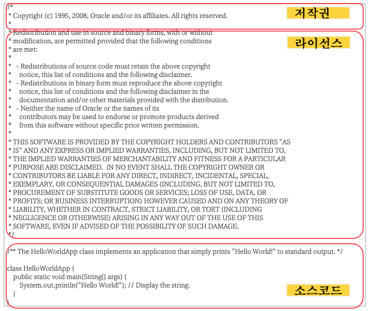
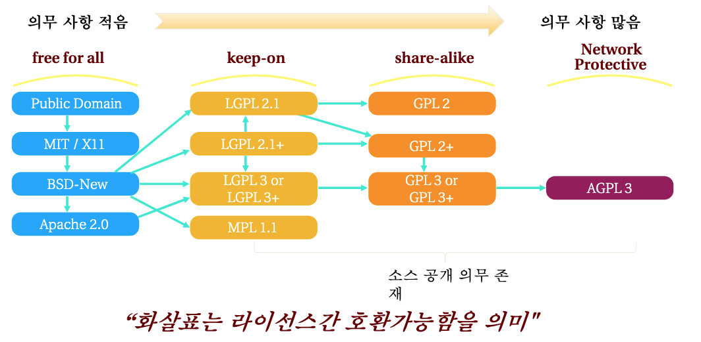
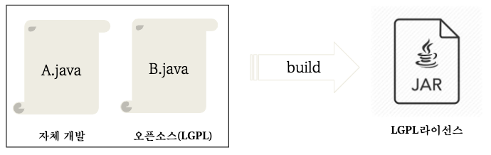
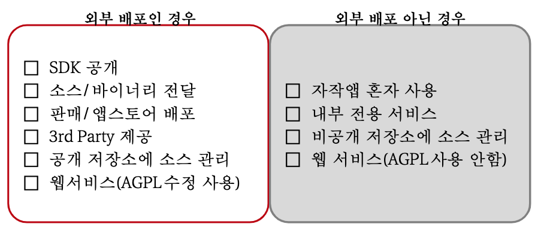
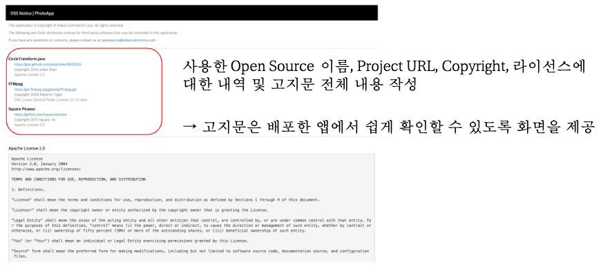

# 오픈소스 라이선스 제대로 알고 사용하기

*Assembled by GimunLee (2020-01-07)*

 

## Goal

- 오픈소스를 사용해서 개발하는 방법에 대해 설명할 수 있다.
- 오픈소스 라이센스를 구분할 수 있다.
- 오픈소스 소프트웨어 배포에 대해 설명할 수 있다.
- 코드 공개 프로세스에 대해 설명할 수 있다.
- GPL License 사용시 주의할 점에 대해 설명할 수 있다.

 

## Software(SW) 라이선스와 저작권

오픈소스 사용자는 오픈소스 라이선스 대여 규칙(의무)를 준수해야합니다.

- SW는 지적재산권에 의해 보호 받고 있는데, 원칙적으로 저작권자만이 해당 SW에 대한 독점 사용 권리를 가집니다.
- 라이선스(License)는 독점 사용 권리에 대해 대여 규칙을 정의해놓은 허가권(License) 입니다.
- 대여 규칙에는 저작권자(SW 개발자)와 사용자간의 이용방법 및 조건의 범위를 명시하고, 대여 방법은 유로 및 무료로 구분됩니다.

 

## 오픈소스 라이선스 공통 의무 사항

오픈소스를 사용하면 라이선스와 저작권(copyright)을 유지해야 합니다.

 

## 오픈소스 라이선스 분류

- `free for all` : 소스코드를 공개할 의무가 없는 라이선스입니다.
- `keep-on` : 수정한 부분의 소스코드와 전체 소스코드를 공개해야하는 의무있는 라이선스입니다. (추가적으로 EPL 등이 있습니다.)
- `share-alike` : 원 저작물 전체를 공개해야하는 의무가 있는 라이선스로, 사용에 주의가 필요한 라이선스입니다. (바이러스 효과를 가집니다.)
- `network protective` : 네트워크를 통해 접근하는 사용자에게 소스코드를 공개해야하는 라이선스입니다.

#### 문제) Apache 2.0과 GPL 2.0은 호환이 가능할까요?

Apache 2.0은 특허를 허용하는 조항이 있으나, GPL 2.0은 차별을 허용하지 않는 조항을 갖고 있기 때문에 호환되지 않습니다.

### 의무사항이 적고 사용하기 쉬운 오픈소스 라이선스

#### 1. BSD

- 소스코드를 공개하지 않아도 되는 대표적인 라이선스입니다.
- 저작권 명시(고지문)
- 적용 사례 : Nginx(The BSD 2-Clause License)

#### 2. MIT

- MIT에서 해당 대학의 SW 공학도들을 돕기 위해 개발한 라이선스입니다.
- 라이선스 및 저작권 명시(고지문)
- 적용 사례 : 부트스트랩, Angular.js, Backbone.js, JQuery

#### 3. Apache

- 아파치 재단의 모든 SW에 적용되는 라이선스입니다.

- BSD 의무사항 + ***특허권 보장 (GPL 2.0으로 배포되는 코드와는 결합 불가능)**

  \*Apache 2.0의 특허 보복 조항을 GPL 2.0에서는 보장하지 않아 라이선스가 충돌합니다. (양립 불가능)

- 적용 사례 : 안드로이드(v2.0), 하둡(v2.0)

### 주의해야 할 라이선스

#### 1. LGPL

- 수정한 소스코드를 LGPL로 공개해야합니다. (`Static Linking` 으로 사용하면 전체 코드 공개 의무 발생)
- LGPL 2.1 + Apache 2.0 = 결합 방식에 따라 배포 불가능 할 수 있습니다.
- 라이선스 및 저작권 명시
- 적용 사례 : 모질라 파이어폭스(v2.1)

#### 2. GPL

- GPL을 사용한 프로젝트를 배포한 경우, 그 프로젝트의 전체 소스코드를 공개해야 합니다.
- 라이선스 및 저작권 명시
- 적용 사례 : 리눅스 커널(v2.0)

#### 3. AGPL

- AGPL 소스코드를 이용한 소프트웨어 전체를 AGPL로 공개해야합니다. **(웹 서비스 포함)**
- 라이선스 및 저작권 명시
- 적용 사례 : 몽고 DB (v3.0)
  - Database Server and Tools : AGPL 3.0
  - Drivers : Apache 2.0

**참고 : ** 안드로이드 계열 라이브러리의 라이선스는 리눅스 커널 위에서 배포돼왔기 때문에, 아파치 2.0을 많이 사용하고, IOS는 MIT를 많이 씁니다. 

 

### 정적 결합(Static Linking)

정적 결합(Static Linking)이란 자체 개발한 소스에 다른 소스를 추가해서 하나의 바이너리를 만드는 것입니다.

LGPL 라이선스와 정적 결합을 하게 되면, 전체 라이선스가 LGPL로 적용되어 소스를 공개해야 합니다.

***LGPL 라이선스를 가지는 소스코드는 결합 방식에 주의해야합니다.***

 

## 오픈소스 소프트웨어 배포

소스코드 및/또는 바이너리(실행파일) 복사본을 다른 사람에게 제공하는 행위입니다. 소스를 다른 사람에게 전달하는 것도 배포에 해당됩니다.

### 배포의 범위

웹 서비스에 AGPL 라이선스가 사용된 경우 배포에 해당될 수 있습니다.

### 오픈소스 라이선스 고지문 작성

배포가 이뤄지면 오픈소스 라이선스 의무사항을 준수해야하고, 오픈소스 사용내역에 대한 고지문을 작성해야 합니다.

 

## 오픈소스를 공개/기여하면 좋은 점

- 투명한 코드 : 가시성 확보, 책임감/능력 향상
- 열린 커뮤니케이션 : 문서화, 이슈 생성, 커밋 로그, 거버넌스
- 기술 중심 : 코드를 중심으로 의사소통과 의사결정
- 개인 명성
- 다양성 보장 : 발견과 개선, 선택과 집중

 

## 내부 코드 공개 프로세스

1. 오픈 여부 승인 : 팀 리더 및 기술 직군 리더 승인
2. 사내 코드/라이브러리의 오픈 계획안 작성
3. **보안, 특허, 오픈소스 라이선스 확인** : 법무 + OSA 지원
4. 저장소 명칭 확정
5. License 확정 : Apache 2.0 추천
   - README/CONTRIBUTING/CLA(Contributor License Agreement) 추가 
6. 사용자/기여자와 커뮤니케이션 채널 준비
   - Company Repository 팀 멤버 권한 조정
7. 오픈 (Private > Public 전환)

 

## 프로젝트 공개 시 주의사항

- 라이선스 명시
  - 라이선스가 없는 경우, 저작권법이 적용되며 타인이 저작물을 복제/배포 할 수 없음
  - 코드 사용시에도 라이선스가 없는 코드는 기본 저작권법 적용
- 사용한 오픈소스의 라이선스 의무사항 준수
  - 사용한 오픈소스를 명시하고 해당 라이선스 의무사항을 준수
  - 의무조항의 충돌로 함께 사용할 수 없는 라이선스가 있는지도 확인
    - Apache 2.0 등 차별조항이 있는 라이선스는 GPL 2.0과 충돌
- 적합한 라이선스 채택
  - 사용한 오픈소스 라이선스와 호환되는 라이선스를 채택 (GPL 사용 = GPL 배포)
  - 자신의 오픈소스의 공유 목적에 맞는 라이선스를 채택

 

## 프로젝트를 오픈소스로 공개하고 나서 할 일

- 빠르고 적절한 대응
  - 올라오는 이슈에 대해서 빠르고 정확한 답변하기
  - 다양한 Pull Request 확인하고, 리뷰하기
  - 담당자 2명이상 지정하기
- 홍보하기
  - 다양한 개발자 사이트에 프로젝트를 소개하기
  - 프로젝트를 이용해서 쉽게 개발할 수 있도록 다양한 가이드 문서와 샘플 작성해서 공유하기
- 로드맵 공유
  - 프로젝트가 나아가는 방향에 대해서 Miles Stone 등으로 작성해서 모두에게 공유하기

 

## OSS 관련 단체

- GNU 프로젝트 운영 및 Free SW 배포/관리 : [Free Software Foundation](https://www.fsf.org/)
- OSS 라이선스 인증 관리 : [OSI (Open source Initiative)](https://opensource.org/)
- GPL 라이선스 기반의 저작권 보호 및 소송지원 단체 : [GPL Violations](http://gpl-violations.org/)
- OSS 개발자를 위한 법적 자문기관 : [SFLC (Software Freedom Law Center)](https://www.softwarefreedom.org/)

- 기타 : Linux Foundation, FOSS, OIN(Open Innovation Network), 국내 OSSF 등

 

## GPL 계열 라이선스 주의사항

- LGPL < GPL < AGPL
  - AGPL이 지켜야할 의무사항이 가장 많고, 라이선스 위험성이 높음

- GPL 사용 = 소스 코드 공개
  - GPL을 사용한 프로젝트를 배포한 경우 그 프로젝트의 전체 소스코드를 공개
  - AGPL은 네트워크로 연결되어 연동되는 프로그램의 전체 소스코드 공개(웹서비스 포함)
- GPL2.0 + Apache2.0 = 배포 불가능
  - Apache2.0의 특허 보복 조항이 GPL2.0에서는 차별금지 조항과 라이선스 충돌
  - ※ 특허 보복 : 사용자가 특허 소송 제기시 라이선스 종료(사용불가)되고 사용료 청구

- LGPL2.1 + Apache2.0 = 결합방식에 따라 배포 불가능
  - LGPL2.1도 특허 보장하지 않으므로 라이선스 충돌(양립불가능) 합니다.
  - LGPL2.1을 사용한 코드가 Apache2.0 오픈소스를 사용한 코드와 독립적으로 사용(Dynamic Linking)되고 있는 경우는 배포 가능

 

## GPL 계열 라이선스 사용 시 대응 방안

- 라이선스 의무사항 준수
  - 전체 소스코드 공개
- 대체 또는 자체 개발
  - 다른 의무사항이 적은 라이선스의 오픈소스로 대체하거나 자체 개발
- 라이선스 구매
  - `다중 라이선스(Multi License)` 정책 여부 확인 

 

## 다중 라이선스(Multi License)

- 하나의 코드를 2가지(dual license) 혹은 그 이상의 라이선스로 배포하는 형태로, 저작권자가 선택사항으로 독자적인 유료 보증 설정 가능한 라이선스
- ex) GPLv2.0, 상용(Commercial) 2가지로 배포

 

## Reference & Additional Resources

- [오픈소스를 사용하고 준비하는 개발자를 위한 가이드](https://github.com/GimunLee/tech-refrigerator/blob/master/Git/resources/%EC%98%A4%ED%94%88%EC%86%8C%EC%8A%A4%EB%A5%BC%20%EC%82%AC%EC%9A%A9%ED%95%98%EA%B3%A0%20%EC%A4%80%EB%B9%84%ED%95%98%EB%8A%94%20%EA%B0%9C%EB%B0%9C%EC%9E%90%EB%A5%BC%20%EC%9C%84%ED%95%9C%20%EA%B0%80%EC%9D%B4%EB%93%9C.pdf)
- https://www.slideshare.net/ifkakao/ss-113145564?from_action=save 

