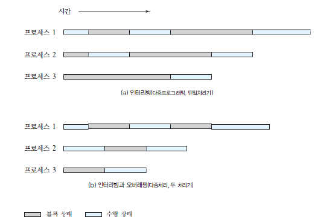

### 02장. 운영체제 개요

---

*Assembled by Ricky (2019-10-23)*

- ##### 목표

  - 운영체제의 핵심 기능에 대한 이해
  - 주요 운영체제 설계 영역에 대한 이해
  - 가상화에 대해 정의하고 설명할 수 있음
  - 운영체제 설계 이슈에 대한 이해

- ##### 운영체제

  - 응용 프로그램의 실행을 제어하는 프로그램
  - 컴퓨터 사용자와 하드웨어 사이에 중재자(intermediary) 역할을 하는 프로그램
  - 커널 (Kernel) : 주 메모리에 상주하는 운영체제 핵심

- ##### 일괄처리 멀티 프로그래밍

  - 여러 개의 프로그램이 메모리에 올라와 CPU를 번갈하가며 사용하며 작업을 수행
  - 멀티 프로그래밍을 위한 운영체제 기능
    - 운영체제에 의해 I/O 작업이 수행
    - 메모리 관리 : 여러 개의 job에 메모리 할당
    - CPU 스케줄링 : 준비 상태에 있는 job 중 하나를 선택해 CPU를 할당
  - 목적 : CPU 이용률(utilization)의 극대화
  - 단점 : 수행중인 job과 상호 작용이 안됨

  - 한 작업이 입출력을 대기해야 할 때, 처리기는 다른 작업으로 제어를 넘김

    

    

- ##### 시분할 시스템 (Time Sharing System)

  - 여러 개의 대화형 작업들을 다루기에 적합
  - 처리기 시간은 여러 사용자들이 공유하며, 터미널을 통해 동시에 시스템에 접근
  - OS는 CPU 시간을 조금(quantum)씩 쪼개어(slicing) 각 사용자 프로그램을 실행시킴

- ##### 일괄처리 멀티프로그래밍과 시분할 시스템 비교

  |             | 일괄 처리 멀티프로그래밍                   | 시분할 시스템              |
  | ----------- | ------------------------------------------ | -------------------------- |
  | 주요 목적   | 처리기 이용률의 최대화                     | 응답시간의 최소화          |
  | 명령어 소스 | 작업과 함께 제공되는 작업 제어 언어 명령어 | 터미널에서 입력되는 명령어 |

---

- ##### 운영체제 핵심 기능 - 프로세스 관리

  1. 멀티프로그래밍 일괄처리 동작 : 처리기는 주 메모리에 있는 다양한 여러 프로그램들을 돌아가며 실행시킴

  2. 시분할 시스템 : 개별 사용자에게 빨리 응답해야 하면서도 동시에 여러 사용자들을 지원할 수 있어야함

  3. Real-time Transaction Systems : 많은 사용자들이 한 DB에 대해 동시에 질의와 갱신을 입력

  ※ *위 3가지는 **타이밍**과 **동기화**라는 문제를 야기했고, 프로세스 개념 탄생에 큰 기여를 함*

  <br>

  - 프로세스의 구성 요소

    1. 실행 가능 프로그램
    2. 프로그램 수행에 필요한 데이터(변수, 작업 공간, 버퍼 등)
    3. 프로그램의 실행 문맥 또는 상태(프로세스 레지스터 값, 우선순위 정보 등)

  - 전형적인 프로세스 구현

    

- **운영체제 핵심 기능 - 메모리 관리**

  - 메모리 관리를 위해 OS가 지원해야할 5가지 핵심 기능
    1. 프로세스 분리
    2. 자동 할당 및 관리
    3. 모듈식 프로그래밍 지원
    4. 보호 및 접근 제어
    5. 영구적 저장 지원
  - 가상 메모리 
    - 주 메모리 크기에 상관 없이 논리적 관점에서 메모리 주소 지정을 할 수 있게 해주는 기법
    - 여러 개의 사용자 프로그램들이 동시에 주 메모리에 올라와 있어도 프로그램들이 통일된 주소 지정 방식을 사용할 수 있게 해주는 역할을 함

  - 페이징 

    - 프로세스 메모리를 페이지라고 하는 고정-크기 블록 단위로 잘라서 관리하는 기법
    - 프로그램은 **가상 주소**를 통해 원하는 워드에 접근
    - 가상 주소
      - 구성 : 가상 페이지 번호 + 페이지 내에서의 오프셋
      - 가상 페이지에 해당하는 실제 페이지는 주 메모리 내 또는 보조기억장치 내 어느 위치에도 존재할 수 있음
      - 가상 주소를 주 메모리 내의 물리주소로 동적으로 바꾸기 위해 OS가 매핑 정보를 제공

  - 가상 메모리 개념

    

  - 가상 메모리 주소 지정

    

  

- **운영체제 핵심 기능 - 스케줄링과 자원 관리**

  - 자원 할당 정책이 반드시 갖고 있어야 할 고려사항

    1. 효율성(Efficiency)
    2. 공정성(fairness)
    3. 반응시간 차등화(Differential Reponsiveness)

  - 멀티프로그래밍을 위한 운영체제 주요 요소

    

- **최근 운영체제 발전**

  - OS는 필요에 따라 OS 구조를 바꾸는 방법을 통해 새로운 기능을 지원하기도 함

    1. ```마이크로커널 구조``` : 몇몇 핵심 기능들만 커널에 포함시킴(address spaces, InterProcess Communication, Basic Scheduling)

       - 장점 : 유연성, 분산 환경에 적합한 커널 구조

    2. ```멀티쓰레딩``` : 한 프로세스를 여러 개의 쓰레드(실행흐름)으로 나누어 병행적으로 실행시키는 기법

       - 쓰레드(Thread) 
         - CPU에 작업을 할당하는 디스패칭 단위
         - 서브루틴 분기/복귀를 가능하게 하기 위한 처리기 문맥과 쓰레드 만의 데이터 영역을 포함하고 있음
         - 순차적으로 실행되며 인터럽트 가능
       - 프로세스(Process) : 하나 이상의 쓰레드와 시스템 자원들의 컨테이너 역할

    3. ```대칭적 멀티프로세싱(SMP)``` : 여러 프로세스들이 동시에 실행될 수 있는 구조

       - 여러 개의 처리기들이 주 메모리와 I/O 장치들을 공유함

       - 모든 처리기들의 능력에 차등이 없음

       - OS는 쓰레드나 프로세스들을 각 처리기로 스케줄링 하고, 처리기들 간의 동기화도 책임짐

       - 장점

         1. 성능 : 여러 프로세스들이 서로 다른 처리기 상에서 동시에 실행될 수 있음
         2. 가용성 : 처리기 하나가 고장 났더라도 시스템 전체가 망가지지는 않음
         3. 점진적 성장 : 시스템에 처리기를 추가하면 추가한만큼 전체 시스템의 성능이 높아짐
         4. 확장성 : 벤더들은 시스템에 장착된 처리기의 개수를 조절하며 제품 라인을 다양하게 출시할 수 있음 

       - 멀티프로그래밍과 멀티프로세싱

         

         

    4. ```분산 운영체제``` 

    5. ```객체-지향 설계``` : 소형화된 커널에 모듈식 확장 기능을 추가할 때 유용하며 시스템 일관성을 깨지 않은 채로 OS를 커스터마이징 하고자 할 때에도 유용

- **결함허용(Fault Tolerance)**

  - 하드웨어나 소프트웨어 고장에도 불구하고 어떤 시스템 또는 컴포넌트가 계속 정상 작동할 수 있는 능력을 일컫는 용어
  - 결함 허용 척도를 시스템에 도입할 것이냐 아니냐는 그 자원이 얼마나 중요한 자원이냐에 따라 결정됨
  - 결함허용 기법
    1. 프로세스 분리(Process Isolation)
    2. 병행성 제어(Concurrency)
    3. 가상 기계(Virtual Machines)
    4. 체크 포인트와 롤백(Checkpoints and Rollbacks)

---

