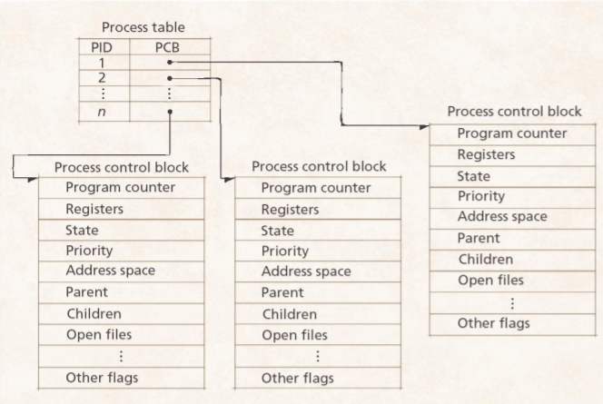

# 03장. 프로세스 기술 및 제어

*Assembled by GimunLee (2019-10-24)*

 

## Goal

- 프로세스를 정의하고, 제어 블록으로 관계를 설명할 수 있음
- 프로세스 상태의 개념을 설명하고, 상태 전이에 대해 설명할 수 있음
- 프로세스 관리를 위한 자료구조 및 자료구조 구성 요소들의 목적을 설명할 수 있음

 

## 운영체제 요구조건

- 운영체제는 적절한 응답 시간을 제공하면서 처리기 이용률을 극대화할 수 있도록 여러 프로세스 수행을 인터리빙(interleaving)해야 함
- 교착상태를 회피함과 동시에 특정 정책(우선순위 부여)에 부합하도록 자원을 프로세스에게 할당해야함
- 프로세스 간 통신과 사용자의 프로세스 생성을 지원하고 구조화하는데 도움이 되야함

 

## 프로세스

- 정의

  - 수행 중인 프로그램
  - 컴퓨터에서 수행 중인 한 프로그램의 인스턴스
  - 한 처리기 상에 할당되어 실행될 수 있는 객체
  - 명령들의 순차 실행, 현재 상태, 연관되어 있는 시스템 명령들의 집합 등으로 특징 지어지는 '활동의 단위'(a unit of activity)

- 구조

  - 프로그램 코드
  - 일련의 데이터, 스택(User Stack vs Kernel Stack)
  - 프로세스 정보

- 프로세스 구성 요소 : 여러 구성 요소들에 의해 유일하게 특징 지어질 수 있음

  

- 프로세스 상태 : 수행 궤적

  

- 2-상태 프로세스 모델

  

- 5-상태 프로세스 모델

  

  - 수행(Running), 준비(Ready), 블록(Blocked), 생성(New), 종료(Exit)

- 스와핑(Swapping)

  - 스왑-아웃(Swap-out) : 종료되지 않은 프로세스의 전체 혹은 일부 이미지를 주기억장치로부터 '스왑 공간'으로 이동시키는 것
  - 스왑-인(Swap-in) : 스왑-아웃된 프로세스의 전체 혹은 일부 이미지를 스왑 공간으로부터 주기억장치로 적재하는 것
  - 스와핑은 더 많은 가용 메모리를 확보하기 위해 사용함
- 스와핑도 **I/O 연산**임

- 보류 상태를 가진 프로세스 상태 전이도
  
  - 보류 상태가 하나인 경우
  
    
  
  - 보류 상태가 둘인 경우
  
    

 

## OS 제어구조(Control Structures)

- 각 프로세스 및 자원의 현재 상태에 대한 정보를 유지

- OS 제어 테이블의 일반적인 구조

  

- 프로세스 테이블 구조

  

- 프로세스 이미지

  - 프로그램(Code or Text)
  - 데이터(전역변수)
  - 스택(지역변수, 매개변수)
  - 힙(동적 메모리 할당)
  - PCB(Process Control Block) (= 태스크 제어 블록, 프로세스 디스크립터)
    - 프로세스 식별
    - 처리기 상태 정보
    - 프로세스 제어 정보

- 프로세스 교환(Process Switching)

  - Clock interrupt : 최대 허용된 시간단위가 지나면 발생(수행 -> 준비)
  - I/O interrupt (블록 -> 준비)
  - Memory Fault (수행 -> 블록)
  - Trap : 수행 중에 발생한 오류 및 예외상황, 해당 프로세스가 종료될 수도 있음(복구 불가)
  - Supervisor Call :  이 때 모드 전환이 발생하며 필요하면 프로세스 교환(파일 오픈)

  

  

