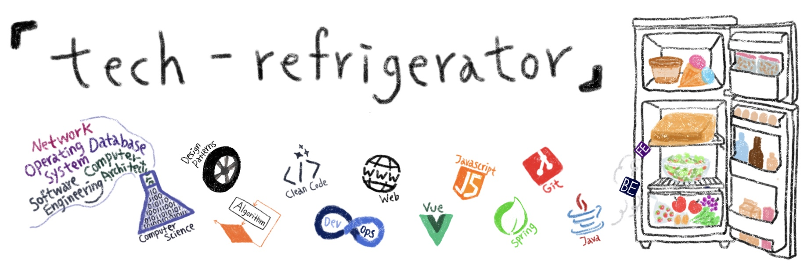

개발자에게 필요하고 유용한 양식들을 모아놓은 기술 냉장고입니다. [`Anna`](https://github.com/ahlim721)와 [`GimunLee`](https://github.com/GimunLee)가 기본적인 지식부터 심화 지식까지 공부하며 채워 넣을게요. 우리의 냉장고가 여러분의 기술 습득, 면접, 스터디 등에 많은 도움이 되기를 바라요.

📝 공부하면서 정리하는 기술 저장소입니다. 여러분들과 소통하며 채워가고 싶어요. 😀

✔ 상한 기술은 `Issue`나 `Pull Request`로 알려주세요.

🤝 기여해주신 분들 : [Donghoon759](https://github.com/Donghoon759) | [DongOnee](https://github.com/DongOnee) | [HaenaraShin](https://github.com/HaenaraShin)

 

## 🥗 Language
- ### 🥬 JAVA 

  - [문자열 클래스](https://github.com/GimunLee/tech-refrigerator/blob/master/Language/JAVA/%EB%AC%B8%EC%9E%90%EC%97%B4%20%ED%81%B4%EB%9E%98%EC%8A%A4.md#%EB%AC%B8%EC%9E%90%EC%97%B4-%ED%81%B4%EB%9E%98%EC%8A%A4) 
  - [동작 원리](https://github.com/GimunLee/tech-refrigerator/blob/master/Language/JAVA/%EB%8F%99%EC%9E%91%20%EC%9B%90%EB%A6%AC.md#%EB%8F%99%EC%9E%91-%EC%9B%90%EB%A6%AC)
  - [JVM & 메모리구조](https://github.com/GimunLee/tech-refrigerator/blob/master/Language/JAVA/JVM%20%26%20%EB%A9%94%EB%AA%A8%EB%A6%AC%EA%B5%AC%EC%A1%B0.md#jvm--%EB%A9%94%EB%AA%A8%EB%A6%AC-%EA%B5%AC%EC%A1%B0)
  - [Garbage Collection](https://github.com/GimunLee/tech-refrigerator/blob/master/Language/JAVA/Garbage%20Collection.md#garbage-collection) 
  - [Primitive type & Reference type](https://github.com/GimunLee/tech-refrigerator/blob/master/Language/JAVA/Primitive%20type%20%26%20Reference%20type.md#primitive-type--reference-type)
  - [Promotion & Casting](https://github.com/GimunLee/tech-refrigerator/blob/master/Language/JAVA/Promotion%20%26%20Casting.md#promotion--casting)
  - [Upcasting & Downcasting](https://github.com/GimunLee/tech-refrigerator/blob/master/Language/JAVA/Upcasting%20%26%20Downcasting.md#upcasting--downcasting)
  - [Error & Exception](https://github.com/GimunLee/tech-refrigerator/blob/master/Language/JAVA/Error%20%26%20Exception.md#error--exception)
  - [제네릭(Generic)](https://github.com/GimunLee/tech-refrigerator/blob/master/Language/JAVA/%EC%A0%9C%EB%84%A4%EB%A6%AD(Generic).md#%EC%A0%9C%EB%84%A4%EB%A6%ADgeneric)
  - [Java Lamda Expression (기초)](https://github.com/GimunLee/tech-refrigerator/blob/master/Language/JAVA/Java%20Lamda%20Expression%20(%EA%B8%B0%EC%B4%88).md#java-lamda-expression-%EA%B8%B0%EC%B4%88)
  - [Java 8 Stream](https://github.com/GimunLee/tech-refrigerator/blob/master/Language/JAVA/Java%208%20Stream.md#java-8-stream)
  

 

## 🍎 Algorithm

- [거품 정렬 (Bubble Sort)](https://github.com/GimunLee/tech-refrigerator/blob/master/Algorithm/%EA%B1%B0%ED%92%88%20%EC%A0%95%EB%A0%AC%20(Bubble%20Sort).md#%EA%B1%B0%ED%92%88-%EC%A0%95%EB%A0%AC-bubble-sort)
- [선택 정렬 (Selection Sort)](https://github.com/GimunLee/tech-refrigerator/blob/master/Algorithm/%EC%84%A0%ED%83%9D%20%EC%A0%95%EB%A0%AC%20(Selection%20Sort).md#%EC%84%A0%ED%83%9D-%EC%A0%95%EB%A0%AC-selection-sort) 
- [삽입 정렬 (Insertion Sort)](https://github.com/GimunLee/tech-refrigerator/blob/master/Algorithm/%EC%82%BD%EC%9E%85%20%EC%A0%95%EB%A0%AC%20(Insertion%20Sort).md#%EC%82%BD%EC%9E%85-%EC%A0%95%EB%A0%AC-insertion-sort)
- [퀵 정렬 (Quick Sort)](https://github.com/GimunLee/tech-refrigerator/blob/master/Algorithm/%ED%80%B5%20%EC%A0%95%EB%A0%AC%20(Quick%20Sort).md#%ED%80%B5-%EC%A0%95%EB%A0%AC-quick-sort)

 

##  🍕 Software Engineering

- [Monolithic Architecture](https://github.com/GimunLee/tech-refrigerator/blob/master/Software%20Engineering/Monolithic%20Architecture.md#monolithic-architecture)
- [Microservice Architecture](https://github.com/GimunLee/tech-refrigerator/blob/master/Software%20Engineering/Microservice%20Architecture.md#microservice-architecture)
- [DDD (Domain Driven Design)](https://github.com/GimunLee/tech-refrigerator/blob/master/Software%20Engineering/DDD%20(Domain%20Driven%20Design).md#ddd-domain-driven-design)
- [TDD (Test Driven Development](https://github.com/GimunLee/tech-refrigerator/blob/master/Software%20Engineering/TDD%20(Test%20Driven%20Development).md#tdd-test-driven-development)

 

## 🍐 Design Pattern [Go!](https://github.com/GimunLee/tech-refrigerator/tree/master/Design%20Pattern#-design-pattern)

- **생성(Creational) 패턴**
  - [싱글톤 (Singleton)](https://github.com/GimunLee/tech-refrigerator/blob/master/Design%20Pattern/Singleton%20Pattern.md#%EF%B8%8F-singleton-pattern)
  - 팩토리 (Factory)
    - [팩토리 메소드 (Factory Method)](https://github.com/GimunLee/tech-refrigerator/blob/master/Design%20Pattern/Factory%20Pattern%20(1)%20-%20Factory%20Method%20Pattern.md#-factory-pattern-1---factory-method-pattern)
  
- **행위(Behavior) 패턴**
  - [스트래티지 (Strategy)](https://github.com/GimunLee/tech-refrigerator/blob/master/Design%20Pattern/Strategy%20Pattern.md#-strategy-pattern)
  - [템플릿 메서드 (Template Method)](https://github.com/GimunLee/tech-refrigerator/blob/master/Design%20Pattern/Template%20Method%20Pattern.md#-template-method-pattern)
  

 

## 🍉 Web

- [서블릿 (Servlet)](https://github.com/GimunLee/tech-refrigerator/blob/master/Web/%EC%84%9C%EB%B8%94%EB%A6%BF%20(Servlet).md#%EC%84%9C%EB%B8%94%EB%A6%BF-servlet)
- [JSP (JAVA Server Page)](https://github.com/GimunLee/tech-refrigerator/blob/master/Web/JSP%20(JAVA%20Server%20Page).md#jsp-java-server-page)

 

## 🥞 Network

- [흐름제어 & 혼잡제어 & 오류제어](https://github.com/GimunLee/tech-refrigerator/blob/master/Network/%ED%9D%90%EB%A6%84%EC%A0%9C%EC%96%B4%20%26%20%ED%98%BC%EC%9E%A1%EC%A0%9C%EC%96%B4%20%26%20%EC%98%A4%EB%A5%98%EC%A0%9C%EC%96%B4.md#%ED%9D%90%EB%A6%84%EC%A0%9C%EC%96%B4--%ED%98%BC%EC%9E%A1%EC%A0%9C%EC%96%B4--%EC%98%A4%EB%A5%98%EC%A0%9C%EC%96%B4)

 

## 🥑 Open Source

- [오픈소스 라이선스 제대로 알고 사용하기](https://github.com/GimunLee/tech-refrigerator/blob/master/Open%20Source/%EC%98%A4%ED%94%88%EC%86%8C%EC%8A%A4%20%EB%9D%BC%EC%9D%B4%EC%84%A0%EC%8A%A4%20%EC%A0%9C%EB%8C%80%EB%A1%9C%20%EC%95%8C%EA%B3%A0%20%EC%82%AC%EC%9A%A9%ED%95%98%EA%B8%B0.md#%EC%98%A4%ED%94%88%EC%86%8C%EC%8A%A4-%EB%9D%BC%EC%9D%B4%EC%84%A0%EC%8A%A4-%EC%A0%9C%EB%8C%80%EB%A1%9C-%EC%95%8C%EA%B3%A0-%EC%82%AC%EC%9A%A9%ED%95%98%EA%B8%B0)

 

## 🍊 Operating System

- ### Lecture Note

  - [01장. 컴퓨터 시스템 개요](https://github.com/GimunLee/tech-refrigerator/blob/master/Operating%20System/Lecture%20Note/01%EC%9E%A5.%20%EC%BB%B4%ED%93%A8%ED%84%B0%20%EC%8B%9C%EC%8A%A4%ED%85%9C%20%EA%B0%9C%EC%9A%94.md#01%EC%9E%A5-%EC%BB%B4%ED%93%A8%ED%84%B0-%EC%8B%9C%EC%8A%A4%ED%85%9C-%EA%B0%9C%EC%9A%94)
  - [02장. 운영체제 개요](https://github.com/GimunLee/tech-refrigerator/blob/master/Operating%20System/Lecture%20Note/02%EC%9E%A5.%20%EC%9A%B4%EC%98%81%EC%B2%B4%EC%A0%9C%20%EA%B0%9C%EC%9A%94.md#02%EC%9E%A5-%EC%9A%B4%EC%98%81%EC%B2%B4%EC%A0%9C-%EA%B0%9C%EC%9A%94)
  - [03장. 프로세스 기술 및 제어](https://github.com/GimunLee/tech-refrigerator/blob/master/Operating%20System/Lecture%20Note/03%EC%9E%A5.%20%ED%94%84%EB%A1%9C%EC%84%B8%EC%8A%A4%20%EA%B8%B0%EC%88%A0%20%EB%B0%8F%20%EC%A0%9C%EC%96%B4.md#03%EC%9E%A5-%ED%94%84%EB%A1%9C%EC%84%B8%EC%8A%A4-%EA%B8%B0%EC%88%A0-%EB%B0%8F-%EC%A0%9C%EC%96%B4) 
  - [04장. 쓰레드](https://github.com/GimunLee/tech-refrigerator/blob/master/Operating%20System/Lecture%20Note/04%EC%9E%A5.%20%EC%93%B0%EB%A0%88%EB%93%9C.md#04%EC%9E%A5-%EC%93%B0%EB%A0%88%EB%93%9C) 
  - [05장. 병행성(상호배제와 동기화)](https://github.com/GimunLee/tech-refrigerator/blob/master/Operating%20System/Lecture%20Note/05%EC%9E%A5.%20%EB%B3%91%ED%96%89%EC%84%B1(%EC%83%81%ED%98%B8%EB%B0%B0%EC%A0%9C%EC%99%80%20%EB%8F%99%EA%B8%B0%ED%99%94).md#05%EC%9E%A5-%EB%B3%91%ED%96%89%EC%84%B1%EC%83%81%ED%98%B8%EB%B0%B0%EC%A0%9C%EC%99%80-%EB%8F%99%EA%B8%B0%ED%99%94)

 

## 🍭 ETC

- [IntelliJ 단축키 (Mac OS X)](https://github.com/GimunLee/tech-refrigerator/blob/master/ETC/IntelliJ%20%EB%8B%A8%EC%B6%95%ED%82%A4%20(Mac%20OS%20X).md#intellij-%EB%8B%A8%EC%B6%95%ED%82%A4-mac-os-x)

 
