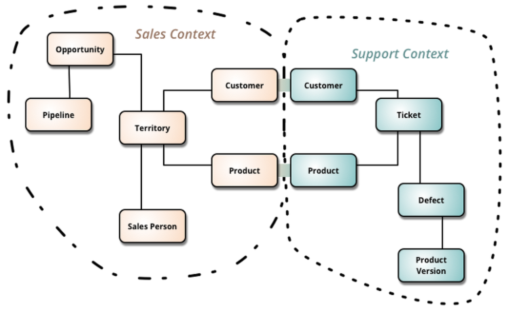
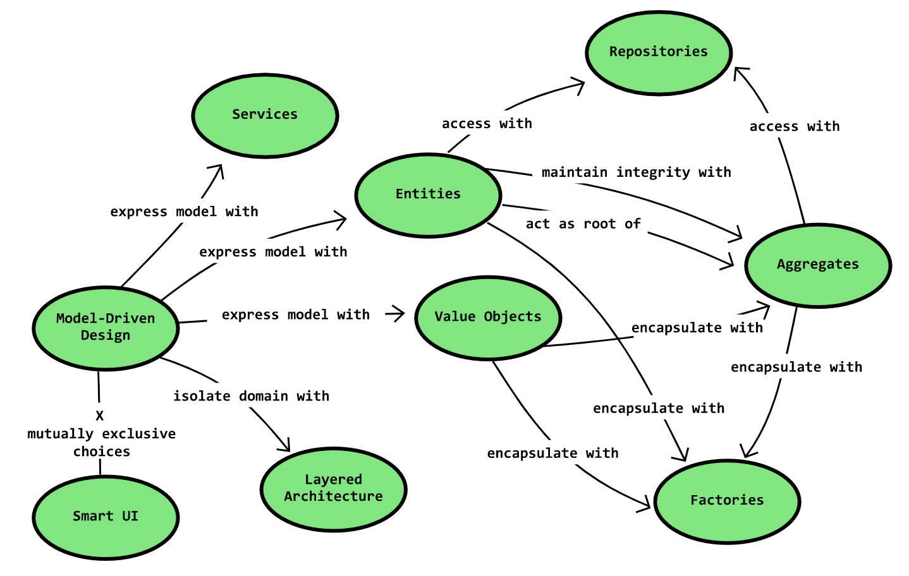

# DDD (Domain Driven Design)

*Assembled by GimunLee (2020-01-13)*

 

## Introduction

이번 장에서는 도메인 주도 설계(Domain Driven Design)에 대해서 알아보겠습니다. 이것이 왜 중요한지는 Domain Driven Design의 저자 Eric Evans의 말로 충분할 것 같습니다.

**Eric Evans, Domain-Driven Design**

> 개발자들이 도메인에 대한 통찰을 얻기 위해 적용할 수 있는 체계적인 사고 방법이 존재한다. 무질서하게 뻗어 나가는 소프트웨어 애플리케이션에 질서를 부여할 수 있는 설계 기법 역시 존재한다. 이런 기술을 연마한다면 익숙하지 않은 도메인을 접하게 될 경우에도 더 가치 있는 개발자로 발전할 수 있게 될 것이다.

 

## Domain

도메인 주도 설계에 대해 알기 위해서는 먼저 도메인에 대해서 알아야합니다. 도메인의 사전적 의미는 "정보와 활동의 영역"을 말하며, 흔히 프로그래머들에게는 **애플리케이션 내의 로직들이 관여하는 정보와 활동의 영역** 이라고 받아들여집니다. 예를들어, 어떤 웹 서비스를 만들 때 회원을 가입하고, 회원을 탈퇴하는 일련의 작업은 "회원"과 관련된 일련의 작업들이며 여기서 "회원"이라는 도메인이 있다고 볼 수 있습니다.

 

## DDD (Domain Driven Design)

도메인 주도 설계란 개발을 함에 있어 위에서 설명한 도메인이 중심이 되는 개발 방식을 말하며, 그 목적은 **소프트웨어의 연관된 부분들을 연결하여 계속해서 진화하는 새로운 모델을 만들어나가 복잡한 애플리케이션을 만드는 것을 쉽게 해주는 것** 에 있습니다. DDD의 핵심적인 목표는 도메인 간 느슨한 결합도(Loose Coupling)와 도메인의 높은 응집도(High Cohesion)로 가벼운 설계를 위해 탄생하였습니다.

결국 도메인 내의 여러 업무 정의나 문제를 어떻게 모델로 표현하고 그것을 바탕으로 구현하기 쉽게 이해할 수 있는 구조로 정의되냐가 DDD의 핵심입니다. 따라서 도메인 모델 설계시 아래의 3가지 요구사항을 충족시켜야 합니다.

1. 모델과 핵심 설계는 상호 영향을 주고 받으며 구체화된다.
2. 모델은 모든 팀 구성원들이 사용하는 언어의 근간을 이룬다.
3. 모델은 불순물을 걸러낸 핵심 지식만을 포함한다.

 

## Ubiquitous Language (보편 언어)

도메인 주도 개발은 Eric Evans가 2003년 출간한 책에서 처음 소개한 방법론으로 "유용한 소프트웨어를 개발하고 싶다면 도메인에 귀를 기울여라"라는 슬로건으로부터 시작됩니다. 

도메인 전문가와 개발자 사이의 의사소통의 어려움은 도메인 컨셉의 Ubiquitous Language 라는 보편적 언어로 표현하는 것을 목표로 합니다. 도메인 모델은 이러한 보편 언어(Ubiquitous Language)의 근간을 제공하고 팀 내의 의사소통 및 구현까지 연결할 수 있도록 하고 있습니다. 즉, 사용되는 언어에 대한 이해가 서로 일치해야 하며, 그렇지 않은 경우 모델 변경 및 코드상으로는 Refactoring으로 이어지는 과정이 나타납니다.

그리고 보편 언어들로 정의할 때 고려되어야할 사항은 Bounded Context(제한 영역) 범위 내에서 정의해야 된다는 것입니다.

Bounded Context는 독립적으로 서비스 될 때 문제없는 업무 범위로 생각할 수 있으며, 쇼핑몰 사이트를 예로 들면 제품 판매 컨텐스트(Sales Context), 판매지원 컨텍스트(Support Text) 등과 같이 분류할 수 있습니다. 이런 여러 context 내에 비슷해 보이는 용어가 서로 틀린 의미로 사용될 수 있기 때문입니다.

이런 언어는 주로 업무 위주의 언어를 사용하는 것이 좋습니다. 일반적으로 용어사전(Glossary) 형태로 구성하는 것이 좋으며, 구성원 누구나 쉽게 참조할 수 있도록 합니다. Project Wiki 사이트 등을 운영하여 유지하는 것이 좋은 방법입니다.

주의할 것은 용어사전 형태로 구성한다고 해서 처음부터 모든 용어를 사전처럼 정의하고 프로젝트를 진행하는 것은 불가능합니다. 기본적으로 DDD는 폭포수 개발 방식보다는 애자일 개발방식과 같은 반복 수행을 통한 완성도를 높이는 Model Exploration Whirlpool(모델 개발 소용돌이) 방식을 대부분 채택하고 있습니다. 우선 도메인에 관련된 핵심 업무 관련 모델에 대한 용어부터 정의하고 그 모델에 대한 이해도를 서로 높이면서 차츰 발전시키는 것이 중요합니다. 

**Eric Evans, Domain-Driven Design**

> 도메인 모델과 소프트웨어 시스템 간의 맵핑이 명확해지도록 도메인 모델을 충실하게 반영하는 소프트웨어 시스템을 설계하라. 도메인에 대한 더 깊은 식견을 반영할 방법을 찾는 순간 소프트웨어 내에서 모델을 더 자연스럽게 구현할 수 있도록 모델을 재검토하고 수정하라. 견고한 유비쿼터스 언어를 지원함과 동시에 두 가지 목적 모두에 잘 부합하는 하나의 모델을 추구하라. 
> 
> 설계에서 사용되는 용어와 기본 책임 할당을 사용해서 모델을 작성하라. 코드는 모델의 표현이 되고 코드에 대한 수정은 모델에 대한 수정이 된다. 효과는 나머지 프로젝트 활동 내내 적절히 파급되어야 한다.

## Domain Model Pattern

도메인 모델 정의 시 몇 가지 구현 패턴이 있는데, 일반적으로 사용되는 패턴은 Entity 기반 모델을 정의하는 패턴을 사용하고 있습니다. 기본 패턴에서 정의되는 요소를 알아보겠습니다. 

### Entity

- 속성이 아닌 **식별성** 을 기준으로 정의되는 도메인 객체
- ex) DB :ERD (Entity - Relationship Model), J2EE : Entity Bean

### Value Object

- 식별성이 아닌 속성을 이용해 정의되는 불변 객체
- 모든 것에 식별성을 부여하고 Entity로 관리한다면 복잡성 증가
- 과거 Javadml DTO(Data Transfer Object) 패턴의 Value Object와 관계 없음
- Entity와 Value Object를 구별하는 첫 번째 조건은 식별성
- 식별성을 가지면 Entity, 그렇지 않으면 Value Obeject

### Service

- Domain Object에서 위치시키기 어려운 Operation을 가지는 객체
- 여러 Domain Object를 다루는 연산 (Servicedml Operation은 일반적으로 stateless)
- Domain Object에 해당되는 역할을 Service Operation으로 만드는 경우, 도메인 역할을 침범하여 결합도가 강해짐

### Module

- 유사 작업 및 개념을 그룹화하여 복잡도를 감소시키는 기법
- 응집도가 높은 모듈은 모듈 간의 관계는 결합도가 약해짐
- Java로 구현하는 경우 Package로 구성될 수 있음

### Aggregate

- 연관된 Entity와 Value Object의 묶음, 일관성과 트랜잭션, 분산의 단위, 캡슐화를 통한 복잡성 관리
- ex) 쇼핑몰 사이트에서 주문 Entity 내에 배송주소 정보를 우편번호, 주소1, 주소2, 상세주소 이런식으로 각 칼럼으로 정의하는 것이 아니라, 주소라는 Value Obeject를 별도로 작성하고 주문 Entity는 주소 Value Object를 포함하는 방식으로 관계 일관성 및 단순화를 유지

### Factory

- 복잡한 Entity의 생성 절차에 캡슐화를 할 수 있는 개념
- 생성하기 복잡한 Aggregate 내의 여러 객체를 동시에 생성
- 생성시 Aggregate의 일관성 유지

### Repository

- 도메인 영역과 Data infrastructure 계층을 분리하여 데이터 계층에 대한 결합도를 낮추기 위한 방안
- 생성된 Aggregate에 대한 영속성 관리, 조회, 등록, 수정, 삭제 시 Aggregate의 일관성 유지
- DB 및 데이터 저장소의 데이터를 조회하고 저장하는 경우 Repository를 활용

 

## Bounded Context

기업 내 웹 서비스는 내부적으로 다양한 Context로 구분되어 질 수 있다. 증권 서비스를 예로 들어보겠습니다. 

- 리서치
- 주식
- 펀드
- 이체

위와 같이 각각의 업무는 분할된 컨텍스트(Bounded Context)로 나눌 수 있으며, 각 Context에 사용되는 모델은 서로 분리되어야하며, 각 하나의 Context는 하나의 팀에 할당되어 관리되는 것이 좋습니다. 또한 이러한 방향은 Microservice Architecture에서 추구하는 방향이기도 합니다.

주의할 것은 Bounded Context는 Module과 다른 영역이며, 도메인 모델에 집중하는 영역입니다. 잘 구성된 Bounded Context 내의 애플리케이션은 독립적 구성이 가능해야 하며, 다른 Context 간의 모델 및 데이터 참조는 정확히 정의된 인터페이스(API) 만으로 통신하여야 합니다. 물론 MSA에 추구하는 Service 단위는 이보다 더 작은 단위지만, 기존 Monolithic Architecture에서 MSA 중간 단계를 거친다면 Bounded Context 단위로 영역을 분리하고 시스템으로 분리하는 것이 좋습니다.

 

## 문서화 방안

그럼 DDD를 통한 소프트웨어 설계 시, 어떻게 문서화할지 고민해 보아야 합니다. 가장 일반적인 방법은 시각화된 UML 다이어그램 또는 그와 유사한 다이어그램을 활용하는 것입니다. 형식이 중요한것이 아니라 관련자가 함께 이해할 수 있는 중심 역할을 해주면 됩니다. 또한, 모델링의 기본 개념은 나무를 보는 것이 아니라 숲을 보는 것으로 모든 것을 포함하여 복잡하게 만들 필요가 없고, 너무 상세화 시킬 필요도 없습니다. UML 작성 시 주의점은 UML 자체가 가지는 정보 전달의 한계가 있기 때문에 일반적인 언어 기술(desription)을 통해 각 요소의 아이디어 핵심을 담아야 합니다.

**Eric Evans, Domain-Driven Design**

> 모델을 언어의 기반으로 삼아라. 팀에서 이루어지는 모든 의사소통과 코드에 적극적으로 공통의 언어를 적용하라. 다이어그램과 문서화 특히 대화에 동일한 언어를 사용하라. 여러가지 모델을 반영하는 다른 표현을 실험해봄으로써 공통 언어 선택에 따르는 어려움을 해소하라. 그 후 새로운 모델에 적합하도록 클래스, 메소드, 모듈의 이름을 변경하여 코드를 리팩토링하라. 일상에서 사용하는 용어를 다르게 사용한 경우 의미에 대한 공감대를 형성하는 것과 동일한 방식으로 대화에 사용하는 용어 상의 혼란 역시 해결하라. Ubiqutious Language의 변경은 곧 모델의 변경이라는 사실을 인식하자.

 

## Reference & Additional Resources

- https://cyberx.tistory.com/57
- https://steemit.com/kr/@frontalnh/domain-driven-design
