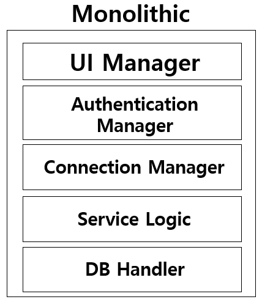
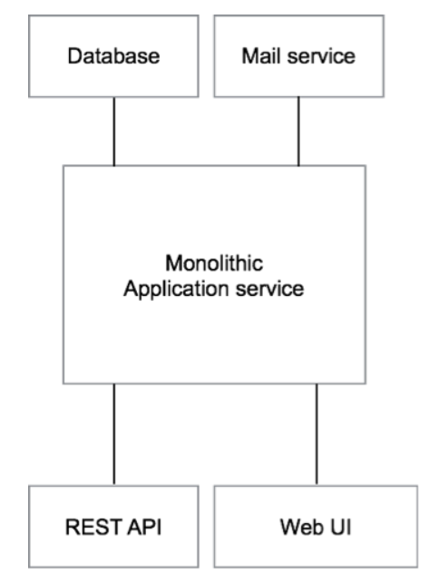

# Monolithic Architecture

*Assembled by Ricky (2019-11-28)*

 

## Goal

- Monolithic Architecture에 대해 설명할 수 있다.
- Monolithic Architecture의 문제점에 대해 설명할 수 있다.

 

## Monolithic Architecture

Microservice Architecture의 각광에 따라 Microservice Architecture가 아닌, 전통의 아키텍처를 지칭하는 의미로 생겨난 단어입니다. 아래의 그림에서 처럼 모든 모듈은 서비스 내부의 Product 형태로 종속되어 있으며, 서비스에만 집중할 수 있는 구조로 되어 있습니다.

이는 Monolithic 이라는 단어의 뜻 그대로 하나의 Massive 한 Context 형태의 아키텍처를 의미하며 **하나의 서비스 또는 어플리케이션이 하나의 거대한 아키텍처를 가질 때, Monolithic 하다고 합니다.** 

 모놀리식 아키텍처를 갖는 Software의 특징은 그 자체로 강건하며 내부 요소간의 Dependency 를 크게 가질 수 있다는 점입니다. 그리고 이는 필연적으로 구조적인 `Coupling` 이 강력하게 유지되는 결과를 초래합니다. 또한 각 비즈니스 컴포넌트들이 하나의 강한 결합 구조를 지니며 통일성이 있습니다

이는 `비즈니스 로직이 서비스에 최적화된 코드`를 만들어내는데 좀 더 집중할 수 있는 반면 `복합적인 예외를 만들 수 있는 위험성을 내포`하게 됩니다.

이해를 돕기 위해서, 아마존(Amazon.com)과 유사한 온라인 쇼핑몰을 만든다고 가정해 보겠습니다. 기본적으로 처음 설계되는 애플리케이션의 구조는 아래 그림과 같이 비즈니스 로직을 담당하고 있는 애플리케이션이 존재하고, 해당 애플리케이션은 데이터베이스 등 외부 시스템과 특정 프로토콜로 통신을 하게 됩니다.

또한, 사용자에게 인터페이스를 제공하기 위해서 HTML을 렌더링하는 부분과 RESTful API를 제공하는 부분을 갖게 됩니다. 이렇게 구성된 애플리케이션의 소스코드는 하나의 프로젝트로 구성되어 있으며 `단일한 패키지로 배포되게 됩니다.`

이러한 구성의 애플리케이션은 특별히 이상할 것도 없고 실제로 많은 서비스들이 이와 같은 구성으로 이루어져 있습니다. 이렇게 단순한 구성의 애플리케이션은 로컬 환경에서 개발하기에도 편리하고 `통합 시나리오 테스트를 수행하기에도 가장 손쉬운 구성` 입니다. 또한, 모든 코드가 하나의 묶음으로 구성되어 있기 때문에 `배포도 매우 간편` 해집니다.

하지만 이러한 단순한 애플리케이션의 아키텍처는 서비스가 `지속적으로 성장하고 규모가 커질 때 한계에 부딪히게 됩니다.` 예를 들어, 3명의 개발자가 몇 가지 핵심 기능을 개발할 때에는 이와 같은 Monolithic Architecture가 최적의 효율성을 보장하지만 개발자의 규모가 수십에서 백명 이상이 되고 서비스의 복잡도가 증가되면 아주 간단한 기능을 하나 추가하기 위해서도 매우 많은 줄의 코드를 수정해야함은 물론, 코드의 변화가 영향을 미치는 범위가 증가되었기 때문에 `간단한 변화 하나에도 통합 테스트가 필요하게 됩니다.`

많은 회사에서는 이러한 문제를 해결하기 위해서 여러가지 프로세스를 도입하고 `애자일 철학을 기반으로 둔 여러가지 방법론을 적용해보고자 노력합니다.` 하지만 실제로 이러한 시도가 서비스 구조의 근본적인 원인을 해결하지는 못하기 때문에 좋은 성과를 거두지 못하게 됩니다. 대부분의 경우 근본적인 원인은 서비스의 구조 자체가 너무 복잡하다는 점입니다. 복잡한 구조는 서비스 초창기 부터 함께 개발을 하여 `전체 히스토리를 알고 있는 소수의 개발자를 제외하고는 대부분의 개발자들이 전체적인 시스템의 구조를 알지 못하기 때문에 재활용 가능한 모듈을 무시하고 중복된 코드를 생산하게 되며 사용하지 않는 코드가 기술 부채로 계속 쌓이게 됩니다.` 또한, 코드가 서로 다양한 방식으로 연관되어 있기 때문에 간단한 버그 수정이 더 큰 버그를 양산하게 되는 결과를 초래합니다.

서비스 복잡도가 증가하면서 Monolithic Architecture가 가지는 문제점들은 `배포 시간의 증가`, `부분적 스케일 아웃의 어려움`, `안정성의 감소` 등 여러가지가 있습니다. 그 중에서도 굳이 한가지를 꼽자면 애플리케이션을 구성하는 프로그래밍 언어, 또는 `프레임워크의 변경이 거의 불가능에 가까울 정도로 어렵다는 점 입니다.` 예를 들어, 애플리케이션에서 사용자의 인증만을 담당하는 요소가 별도의 서비스로 구현되어 있다면 필요에 따라 성능과 안정성을 증가시킬 수 있는 새로운 프레임워크로 변경하는 것을 고려해볼 수 있습니다. 하지만 만약 전체 애플리케이션이 하나로 묶여 있다면 그동안 개발된 방대한 양의 코드를 새로운 언어, 또는 프레임워크로 전환해야 하기 때문에 대부분 시도조차 할 수 없을 것 입니다. 

 

## 장점

**개발의 용이성**

구조가 단순하기 때문에 개발이 용이하고, 크지 않은 프로젝트의 경우 오히려 모듈별로 분리하고 나누는 것은 코드의 최적화 및 구현에 방해가 되는 경우가 많습니다.  

**테스트와 배포의 용이성**

모든 코드가 하나의 묶음으로 구성되어 있기 때문에 배포도 매우 간편해지고, 통합 시나리오 테스트를 수행하기에도 수월합니다.

 

## 단점

**부분적 스케일아웃의 어려움**

일반적으로 `Microservice Architecture의 Scalability 복잡도가 N+M` 이라면 `Monolithic Architecture의 복잡도는 N*M` 형태로 증가하기 때문에 컨테이너의 과부하와 배포 및 스케일링의 어려움을 겪게 됩니다.

**배포 시간의 증가**

최근 클라우드 환경이 각광받으면서 두드러지게된 단점으로 하나의 모듈을 수정하기 위해서는 전체 어플리케이션의 배포가 수반되며 서버 기동, 빌드 및 배포 시간이 오래걸린다는 점이 있습니다.

**안정성의 감소**

기술 스택의 선택폭이 좁아지며 많은 문제를 해결하기 위해 보다 강력하고 탄탄한 기술력이 요구됩니다. 이는 내부 구성요소들 간의 강력한 Dependency 문제 때문입니다. 한 모듈의 선택은 다른 외부 모듈에서 버그를 초래할 수 있습니다. 따라서 사용하고자 하는 프로젝트의 큰 그림이 아키텍처 구성 단계에서 그려져 있어야 문제를 최소화할 수 있습니다.

 

## Reference & Additional Resources

- [http://guruble.com/%EB%A7%88%EC%9D%B4%ED%81%AC%EB%A1%9C%EC%84%9C%EB%B9%84%EC%8A%A4microservice-%EC%95%84%ED%82%A4%ED%85%8D%EC%B2%98-%EA%B7%B8%EA%B2%83%EC%9D%B4-%EB%AD%A3%EC%9D%B4-%EC%A4%91%ED%97%8C%EB%94%94/](http://guruble.com/마이크로서비스microservice-아키텍처-그것이-뭣이-중헌디/)
- [https://jins-dev.tistory.com/entry/%EC%A0%84%ED%86%B5%EC%9D%98-%EC%86%8C%ED%94%84%ED%8A%B8%EC%9B%A8%EC%96%B4-%EC%95%84%ED%82%A4%ED%85%8D%EC%B2%98-%EB%AA%A8%EB%8D%B8-%EB%AA%A8%EB%86%80%EB%A6%AC%EC%8B%9DMonolithic-%EC%95%84%ED%82%A4%ED%85%8D%EC%B2%98](https://jins-dev.tistory.com/entry/전통의-소프트웨어-아키텍처-모델-모놀리식Monolithic-아키텍처)
- https://www.popit.kr/why-microservice/ 
- http://www.moreagile.net/2014/10/microservices.html 