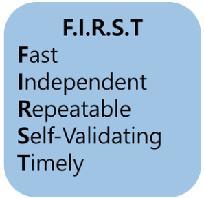

# TDD (Test Driven Development)

*Aseembled by GimunLee (2020-01-13)*

 

## Introduction

\*린(Lean) 소프트웨어 개발론의 핵심 철학 중 하나는 **“결함은 발견 즉시 해결”** 입니다. 린 개발은 이것의 실천법으로 테스트 주도 개발(Test-Driven Development, TDD)을 제시합니다. 

**Microsoft, IBM**

> TDD를 도입한 소프트웨어는 약 15~35% 정도의 개발시간 증가, 결함율(버그)은 약 40~90% 정도 줄어들었다.

이번 장에서는 TDD의 개념과 방법론에 대해 알아보겠습니다.

\**린 소프트웨어 개발론 : 린 (lean) 제조 원칙과 관행을 소프트웨어 개발 영역으로 변환한 것*

 

## TDD (Test Driven Development) 란?

TDD는 반복 테스트를 이용한 소프트웨어 개발법입니다. **작은 단위의 테스트 케이스를 작성하고 이를 통과하는 코드를 추가하는 단계를 반복하여 소프트웨어를 구현합니다.**

TDD의 목표는 작동하는 깔끔한 코드 `Clean code that works` 입니다. 이를 위해 두 가지 원칙을 제시합니다. 

- 오직 자동화된 테스트가 실패할 경우에만 새로운 코드를 작성한다.
- 중복을 제거한다.

린(Lean)에서는 불필요한 기능 구현을 가장 큰 낭비로 여깁니다. 이는 코드베이스의 복잡성을 높이고, 유지 보수를 어렵게 하여 높은 개발 비용을 초래합니다. TDD도 테스트를 통과시키는 코드만을 작성함으로써 맥락을 같이 합니다. 

**요구사항 분석 → 설계 → 개발 → 테스트 → 배포 **

위와 같은 개발법엔 소프트웨어 개발을 느리게 하는 잠재적 위험이 존재합니다.  

- 소비자의 요구사항이 처음부터 명확하지 않을 수 있다. 따라서 처음부터 완벽한 설계는 어렵다.
- **설계 → 개발** 을 진행하면, 실제 코드와 설계 간 갈등이 생길 수 있다.
- 한 곳의 수정이 다른 곳에 미치는 영향을 확인 및 다른 기능의 정상 동작을 보장하기 어렵다.

TDD는 테스트 케이스를 생성합니다. 테스트 케이스는 자동화된 테스트 도구로 이용되어, 코드 변경시 기존 기능이 제대로 동작하는지 쉽게 확인할 수 있고 정상 동작을 보장합니다. 또한, TDD는 리팩토링을 개발 프로세스에 포함시켜 "변경"이라는 소프트웨어의 특성을 반영합니다.

애자일 개발론의 *Robert C. Martin* 은 다음의 TDD 원칙을 제시합니다.

- 실패하는 테스트를 작성하기 전에는 절대로 제품 코드를 작성하지 않는다.
- 실패하는 테스트 코드를 한 번에 하나 이상 작성하지 않는다.
- 현재 실패하고 있는 테스트를 통과하기에 충분한 정도를 넘어서는 제품 코드를 작성하지 않는다.

이 세 가지 규칙은 나노 주기라 불립니다. 그 이유는 코드의 행 단위의 개발 및 테스트가 이루어지게 됩니다. 이때 초 단위의 반복적인 테스트 주기가 발생하게 되는데 이 주기를 TDD의 나노 주기라 부릅니다. *Kent Beck* 과 *Robert C. Martin* 은 테스트 코드 작성에 있어 다양한 스타일이 있지만, 위와 같은 세 가지 규칙을 벗어난 개발 스타일을 금기시하고 있습니다.

 

## TDD 개발법

초 단위에 발생되는 나노 주기가 있다면 분 단위에 발생되는 RGR 주기가 있습니다. RGR 주기는 단위 테스트(Unit Test)마다 발생되며, RGR 주기의 규칙은 다음과 같습니다.

1. `RED` :  실패하는 단위 테스트 만들기 
2. `GREEN` : 테스트가 통과하도록 작성하기
3. `REFACTOR` : 통과된 테스트 코드를 리팩토링하기

여기서 우리는 Red 단계에서 Green로 진행되는 과정을 살펴봐야됩니다. 이 과정에서 *Kent Beck* 은 테스트를 통과하기 위해 금기(복붙, 설계를 무시한 개발)가 되는 행동을 해도 된다고 합니다. 이때 발생하는 중복된 코드, 올바르지 못한 구조 등은 Refactor 단계에서 해결해준다고 말합니다.

RGR 주기에 대한 아이디어는 *Kent Beck* 의 빨리 작동하는 코드 개발(TDD 원초적인 공식)으로 부터 착안했습니다. 결국 그 원초적인 공식에 따라 RGR 주기는 소프트웨어가 제대로 작동하는 데에 목적이 있습니다. 또한 RGR 주기는 실제 개발 단계에서 개발과 동시에 리팩토링을 하기 위한 활동입니다.

### Unit Test

앞서 TDD의 주기들은 어디까지나 TDD가 `Clean code that works`을 지향하고 있기 때문입니다. `Clean code that works` 를 실현하기 위해선 리팩토링 과정은 필연적입니다. 리펙토링은 RGR 주기에서 단위 테스트 단위로 이루어지고 있는데 이 때문에 단위 테스트와 TDD는 밀접한 관계를 맺고 있습니다.

다만 주객이 바뀌면 안 됩니다. 이 점은 많은 개발자가 오해하는 부분인데 단위 테스트를 하는 이유는 TDD가 지향하는 `Clean code that works`을 실현하기 위한 일종의 방법이지 단위 테스트를 하기 위해 TDD를 한다는 건 말은 모순이기 때문입니다.

- **TDD : 설계 프로세스**
- **단위 테스트 : 정밀한 테스트 케이스**

일반적으로 단위 테스트는 객체 또는 모듈의 함수(자바에서는 클래스)에 초점을 맞춥니다. 테스트가 단일 기능에 한정되도록 함으로써 테스트는 간단하고 신속하게 이루어집니다. 특히 단위 테스트는 코드를 변경해야 하는 경우 유용합니다. 코드가 작동하는지 확인하는 단위 테스트가 있으면 코드를 안전하게 변경할 수 있고 실행 시 다른 부분에서 프로그램이 중단되지 않는다는 점을 확신할 수 있습니다.

### 단위 테스트의 FIRST 규칙

다음과 같이 *Robert C. Matin* 은 단위 테스트의 규칙을 정의했습니다. 

- `Fast` : 단위 테스트는 빨라야 한다.
- `Independent` : 단위 테스트는 독립적으로 작성한다.
- `Repeatable` : 단위 테스트는 어느 환경에서든 반복 가능해야 한다.
- `Selef-Validating` : 단위 테스트는 자체검증이 되어야 한다.
- `Timely` : 단위 테스트는 실제 코드를 작성 전에 작성해야 한다.

#### Fast

테스트는 빨라야 합니다. 여기서 빠름의 기준은 밀리 초(ms)입니다. 단위 테스트를 테스트하는 데 있어 실행 시간이 0.5 초 또는 0.25 초가 걸리는 테스트는 빠른 테스트가 아닙니다.

하나의 프로젝트에서 적게는 몇백 개에서 많게는 수천 개의 테스트를 할 수 있으므로 테스트의 실행 시간은 빨라야 합니다. 만약 테스트가 느리다면 개발자는 테스트를 주저하게 되고 자주 검증하지 않은 소스코드는 그만큼 버그가 발생할 확률이 높아집니다.

#### Independent

테스트에 사용된 데이터들은 서로 의존하면 안 됩니다. 테스트에 필요한 데이터는 테스트 내부에서 독립적으로 사용해야 합니다. 만약 데이터가 서로에게 의존하면 테스트 하나가 실패할 때 나머지도 잇달아 실패하므로 원인을 진단하기 어려워지기 때문입니다. 때론 데이터의 존재 여부를 찾는 테스트가 있는 경우엔 해당 데이터는 테스트 내부에서 생성되어야 하며 나중에 테스트에 영향을 미치지 않도록 제거해야 합니다.

#### Repeatable

테스트는 어느 환경에서든 반복적으로 테스트를 실행할 수 있어야 합니다. 여기서 환경은 네트워크 나 데이터베이스에 의존하지 않는 환경을 뜻합니다. 결론적으로 인터넷이 되든 안 되든 데이터베이스에 접속하든 안 하든 언제 어디서나 테스트를 할 수 있어야 합니다. 환경에 의존하지 않는 테스트가 실패할 수 있는 유일한 이유는 오로지 테스트할 클래스 또는 메소드가 제대로 작동하지 않기 때문입니다.

#### Selef-Validating

테스트는 자체 검증이 되어야 합니다. 테스트의 검증은 수작업이 아닌 자동화가 되어야 하는데 테스트가 실행될 때마다 메서드 출력이 올바른지를 확인하는 것은 개발자가 결정해서는 안 됩니다. 이 때문에 자바 환경에서는 테스트에 대한 검증을 지원하는 `JUnit` 을 사용하여 테스트의 통과 여부를 결정합니다.

#### Timely

단위 테스트는 실제 코드를 작성하기 전에 작성해야됩니다. 이 규칙은 TDD를 수행하는 경우 반드시 따라야 하는 규칙입니다. 

 

## TDD의 장점 & 단점

### 장점

- 작업과 동시에 테스트를 진행하면서 실시간으로 오류 파악이 가능하다.
- 재설계 시간을 단축하여 높은 품질의 소프트웨어를 보장한다.
- 짧은 개발 주기를 통해 진행 상황 파악과 고객의 추가 요구사항 반영이 비교적 쉽다.
- 자동화 도구를 이용한 TDD 테스트케이스를 단위 테스트로 사용이 가능하다. (Java : JUnit, C, C++ : CppUnit)

### 단점

- 기존 개발 프로세스에 테스트케이스 설계가 추가되므로 생산 비용 증가한다.

- 테스트의 방향성, 프로젝트 성격에 따른 테스트 프레임워크 선택 등 추가로 고려할 부분의 증가한다.

 

## Reference & Additional Resources

- https://soulpark.wordpress.com/2012/09/12/test-driven-development/
- https://nesoy.github.io/articles/2017-01/TDD
- [https://ahea.wordpress.com/2018/09/10/%EC%84%A0%ED%83%9D%EC%9D%B4-%EC%95%84%EB%8B%8C-%ED%95%84%EC%88%98-tdd/](https://ahea.wordpress.com/2018/09/10/선택이-아닌-필수-tdd/)