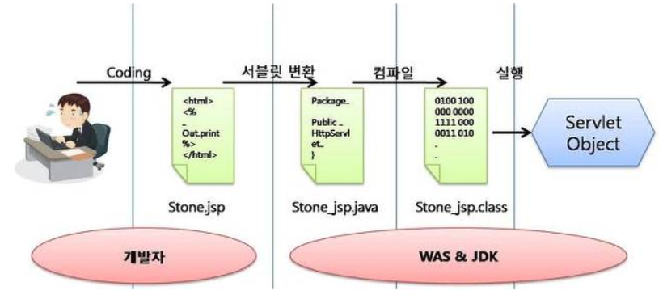

# JSP (JAVA Server Page)

*Assembled by GimunLee (2019-11-07)*

 

## Goal

- JSP에 대해 설명할 수 있다.
- JSP 동작 과정에 대해 설명할 수 있다.

 

## JSP란?

**JAVA 코드가 들어가있는 HTML 코드** 입니다.` Servlet은 자바 소스코드 속에 HTML코드가 들어가는 형태`인데, JSP는 이와 반대로 `HTML 소스코드 속에 자바 소스코드가 들어가는 구조를 갖는 웹어플리케이션 프로그래밍 기술`입니다. 

HTML 속에서 자바코드는 `<% 소스코드 %>` 또는 `<%= 소스코드 =%>` 형태로 들어갑니다. 자바 소스코드로 작성된 이 부분은 웹 브라우저로 보내는 것이아니라 웹 서버에서 실행되는 부분입니다. 웹 프로그래머가 소스코드를 수정 할 경우에도 디자인 부분을 제외하고 자바 소스코드만 수정하면 되기에 효율을 높여줍니다. 또한 컴파일과 같은 과정을 할 필요없이 JSP 페이지를 작성하여 웹 서버의 디렉토리에 추가만 하면 사용이 가능합니다. 

서블릿 규칙은 꽤나 복집하기 때문에 JSP가 나오게 되었는데 JSP는 `WAS(Web Application Server)에 의하여 서블릿 클래스로 변환하여 사용`되어 집니다.  

 

## JSP 동작 과정

1. 웹 서버가 사용자로부터 서블릿에 대한 요청을 받으면 `서블릿 컨테이너`에 그 요청을 넘깁니다. 

2. 요청을 받은 컨테이너는 HTTP Request와 HTTP Response 객체를 만들어, 이를 doPost() 또는 doGet() 중 하나를 호출합니다. 

   만약 서블릿만 사용하여 사용자가 요청한 웹 페이지를 보여주려면 out 객체의 println 메소드를 사용하여 HTML 문서를 작성해야 하는데 이는 추가/수정을 어렵게 하고, 가독성도 떨어지기 때문에 JSP를 사용하여 `비지니스 로직`과 `프레젠테이션 로직`을 분리합니다. 

   여기서 서블릿은 데이터의 입력, 수정 등에 대한 제어를 JSP에게 넘겨서 프레젠테이션 로직을 수행한 후 컨테이너에게 Response를 전달합니다. 

3. 이렇게 만들어진 결과물은 사용자가 해당 페이지를 요청하면 컴파일이 되어 자바파일을 통해 `.class 파일`이 만들어지고, 두 로직이 결합되어 클래스화 되는것을 확인할 수 있습니다. 즉, out객체의 println 메소드를 사용해서 구현해야하는 번거로움을 JSP가 대신 수행해줍니다 

 

## References &  Additional Resources

- https://mangkyu.tistory.com/14 
- https://gmlwjd9405.github.io/2018/11/04/servlet-vs-jsp.html 
- https://gmlwjd9405.github.io/2018/10/27/webserver-vs-was.html 

