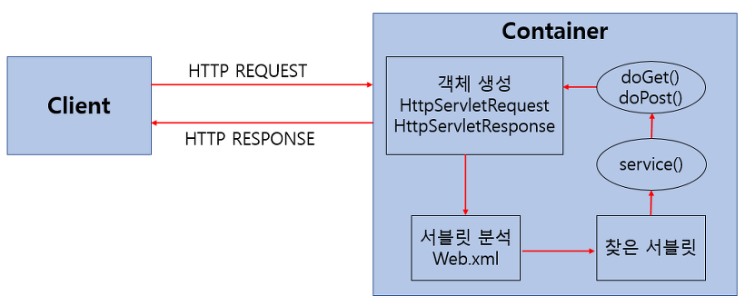
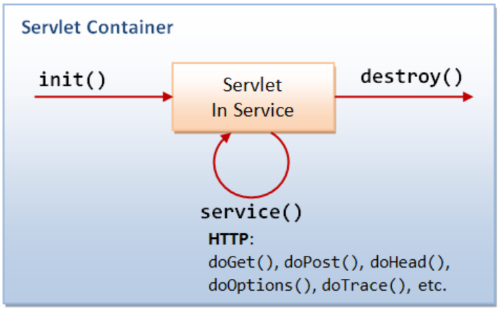
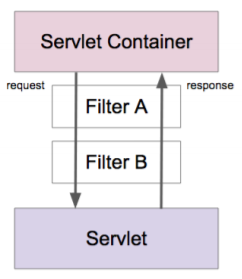

# 서블릿 (Servlet)

*Assembled by Ricky (2019-11-07)*

<br>

## Goal

- Servlet에 대해 설명할 수 있다.
- Servlet의 동작 과정을 설명할 수 있다.
- Servlet Container 역할에 대해 설명할 수 있다.
- Servlet Life Cycle에 대해 설명할 수 있다.

<br/>

## Servlet이란?

자바 플랫폼에서 컴포넌트를 기반으로 하는 **웹 애플리케이션의 핵심 기술** 입니다. 좀 더 풀어쓰자면 웹 프로그래밍에서 `클라이언트의 요청을 처리`하고, 그 결과를 다시 클라이언트에게 전송하는 `Servlet 클래스의 구현 규칙을 지킨 자바 프로그래밍 기술`입니다.

<br/>

## Servlet 특징

- 클라이언트의 요청에 대해 동적으로 작동하는 웹 애플리케이션 컴포넌트입니다.
- Java Thread를 이용합니다.
- HTTP 서비스를 지원하는 javax.servlet.http.HttpServlet 클래스를 상속받으며, UDP보다 속도가 느립니다.
- HTML 변경 시 Servlet을 재컴파일해야 하는 단점이 있습니다.

일반적으로 웹서버는 정적인 페이지만을 제공합니다. 그렇기에 동적인 페이지를 제공하기 위해서 웹서버는 다른 곳에 도움을 요청하여 동적인 페이지를 작성해야 합니다. 동적인 페이지로는 임의의 이미지만을 보여주는 페이지와 같이 사용자가 요청한 시점에 페이지를 생성해서 전달해 주는 것을 의미합니다. 여기서 웹서버가 `동적인 페이지를 제공할 수 있도록 도와주는 어플리케이션`이 서블릿이며, 동적인 페이지를 생성하는 어플리케이션이 **CGI(Common Gateway Interface)** 입니다. 

<br/>

## CGI(Common Gateway Interface)란?

CGI는 특별한 라이브러리나 도구를 의미하는 것이 아니고, **별도로 제작된 웹서버와 프로그램간의 교환방식** 입니다. CGI방식은 어떠한 프로그래밍 언어로도 구현이 가능하며, 별도로 만들어 놓은 프로그램에 HTML의 Get 또는 Post 방법으로 클라이언트의 데이터를 환경변수로 전달하고, 프로그램의 표준 출력 결과를 클라이언트에게 전송하는 것입니다. 즉, 자바 어플리케이션 코딩을 하듯 웹 브라우저용 출력 화면을 만드는 방법입니다.

<br/>

## Servlet 동작 과정



1. 사용자(클라이언트)가 URL을 클릭하면 HTTP Request를 `Servlet Conatiner`로 전송합니다.
2. HTTP Request를 전송받은 Servlet Container는 `HttpServletRequest`, `HttpServletResponse` 두 객체를 생성합니다.
3. `web.xml`은 사용자가 요청한 URL을 분석하여 어느 서블릿에 대해 요청을 한 것인지 찾습니다.
4. 해당 서블릿에서 service 메소드를 호출한 후 클리아언트의 POST, GET여부에 따라 doGet() 또는 doPost()를 호출합니다.
5. doGet() 또는 doPost() 메소드는 동적 페이지를 생성한 후 `HttpServletResponse 객체`에 응답을 보냅니다.
6. 응답이 끝나면 `HttpServletRequest`, `HttpServletResponse` 두 객체를 소멸시킵니다.

<br/>

## HTTP를 이용한 서버와 클라이언트의 통신 과정

클라이언트는 정보를 얻기 위해 서버로 `HTTP 요청 메세지 + 매개변수`를 전송하고, 서버는 이를 해석하여 정적 자원에 대한 요청일 경우 자원을 반환해주고, 그렇지 않은 경우 CGI 프로그램을 실행시켜 해당 결과를 리턴해줍니다. 이때, 서버는 CGI 프로그램에게 클라이언트의 요청과 매개변수를 전달해주고, 결과를 전달받기 위한 파이프라인을 연결합니다. 

그래서 CGI 프로그램은 입력에 대한 서비스를 수행하고, 결과를 클라이언트에게 전달하기 위해 결과 페이지에 해당하는 MIME 타입의 컨텐츠 데이터를 웹 서버와 연결된 파이프라인에 출력하여 서버에 전달합니다. 서버는 파이프라인을 통해 CGI 프로그램에서 출력한 결과 페이지의 데이터를 읽어, HTTP 응답헤더를 생성하여 데이터를 함께 반환해줍니다.

<br/>

## Servlet Container

우리가 서버에 서블릿을 만들었다고 해서 스스로 작동하는 것이 아니고, 서블릿을 관리해주는 것이 필요한데 그러한 역할을 하는 것이 바로 **Servlet Container** 입니다. 

예를 들어, 서블릿이 어떠한 역할을 수행하는 정의서라고 보면, 서블릿 컨테이너는 그 정의서를 보고 수행한다고 볼 수 있습니다. 서블릿 컨테이너는 클라이언트의 요청(Request)을 받아주고 응답(Response)할 수 있게, 웹 서버와 소켓을 만들어 통신하며 대표적인 예로 `톰캣(Tomcat)`이 있습니다. 톰캣은 실제로 웹 서버와 통신하여 JSP(자바 서버 페이지)와 Servlet이 작동하는 환경을 제공해줍니다. 

<br/>

## Servlet Container 역할

1. **웹 서버와의 통신 지원**

   `서블릿 컨테이너는 서블릿과 웹서버가 손쉽게 통신할 수 있게 해줍니다.` 일반적으로 우리는 소켓을 만들고 listen, accept 등을 해야하지만 서블릿 컨테이너는 이러한 기능을 API로 제공하여 복잡한 과정을 생략할 수 있게 해줍니다. 그래서 개발자가 서블릿에 구현해야 할 `비지니스 로직에 대해서만 초점을 두게끔 도와줍니다.`

2. **서블릿 생명주기(Life Cycle) 관리**

   서블릿 컨테이너는 서블릿의 `탄생`과 `죽음`을 관리합니다. 서블릿 클래스를 로딩하여 인스턴스화하고, 초기화 메소드를 호출하고, 요청이 들어오면 적절한 서블릿 메소드를 호출합니다.  또한, 서블릿이 생명을 다 한 순간에는 적절하게 `Garbage Collection(가비지 컬렉션)`을 진행하여 편의를 제공합니다.

3. **멀티쓰레드 지원 및 관리**

   서블릿 컨테이너는 `요청이 올 때 마다 새로운 자바 쓰레드를 하나 생성` 하는데, HTTP 서비스 메소드를 실행하고 나면, 쓰레드는 자동으로 죽게됩니다. 원래는 쓰레드를 관리해야 하지만 `서버가 다중 쓰레드를 생성 및 운영해주니 쓰레드의 안정성에 대해서 걱정하지 않아도 됩니다.`

4. **선언적인 보안 관리**

   서블릿 컨테이너를 사용하면 개발자는 보안에 관련된 내용을 서블릿 또는 자바 클래스에 구현해 놓지 않아도 됩니다. 일반적으로 보안관리는 `XML 배포 서술자` 에다가 기록하므로, 보안에 대해 수정할 일이 생겨도 자바 소스 코드를 수정하여 다시 컴파일 하지 않아도 보안관리가 가능합니다.

<br/>

## Servlet Life Cycle



1. 클라이언트의 요청이 들어오면 컨테이너는 해당 서블릿이 메모리에 있는지 확인하고, 없을 경우 `init()`을 호출하여 적재합니다. init()은 처음 한번만 실행되기 때문에, `서블릿의 쓰레드에서 공통적으로 사용해야하는 것이 있다면 오버라이딩하여 구현`하면 됩니다. 실행 중 서블릿이 변경될 경우, 기존 서블릿을 파괴하고 init() 을 통해 새로운 내용을 다시 메모리에 적재합니다.

2. init()이 호출된 후 클라이언트의 요청에 따라서 service()를 통해 요청에 대한 응답이 `doGet()`과 `doPost()`로 분기됩니다. 이때 서블릿 컨테이너가 클라이언트의 요청이 오면 `가장 먼저 처리하는 과정으로 생성된 HttpServletRequest, HttpServletResponse에 의해 request와 response객체가 제공`됩니다.

3. 컨테이너가 서블릿에 종료 요청을 하면 `destroy()`가 호출되는데 마찬가지로 한번만 실행되며, 종료시에 처리해야하는 작업들은 destroy()를 오버라이딩하여 구현하면 됩니다.

- Sample Code

  ```java
  public class HelloServlet extends HttpServlet {
      @Override
      public void init() throws ServletException {
      	System.out.println("init");
      }
      
      @Override
      protected void doGet(HttpServletRequest req, HttpServletResponse resp) throws ServletException, IOException {
          System.out.println("doGet");
          resp.getWriter().write("Hello Servlet");
  	}
      @Override
      public void destroy() {
          System.out.println("destroy");
      }
  }
  ```

<br/>

## Servlet Listener & Servlet Filter

- Servlet Listener

  웹 애플리케이션에서 발생하는 주요 `이벤트를 감지`하고, 각 이벤트에 특별한 작업이 필요한 경우에 사용할 수 있습니다.

  - Servlet Context 수준의 Event
    - Context Life Cycle Event
    - Context Attribute Change Event
  - Session 수준의 Event
    - Session Life Cycle Event
    - Session Attribute Change Event

- Servlet Filter

  - 들어온 요청을 Servlet으로 보내거나, Servlet이 작성한 응답을 클라이언트로 보내기 전에 처리가 필요한 경우에 사용할 수 있습니다.

  - Filter는 아래와 같이 `Chain 구조`를 갖고 있습니다.

    

<br/>

## References &  Additional Resources

- https://mangkyu.tistory.com/14 
-  https://gmlwjd9405.github.io/2018/11/04/servlet-vs-jsp.html 
-  https://gmlwjd9405.github.io/2018/10/27/webserver-vs-was.html 

